# Design Modelling

## UML Models Overview

This document provides the complete visual model for the **Unified Patient Access & Clinical Intelligence Platform**. All diagrams are derived directly from [spec.md](.propel/context/docs/spec.md) (functional requirements and use cases) and [design.md](.propel/context/docs/design.md) (NFR/DR/TR/AIR constraints and architectural decisions).

**Navigation guide:**

| Section | Diagrams | Purpose |
|---------|----------|---------|
| [Architectural Views](#architectural-views) | DM-001 to DM-005 + 4 AI sequences | System structure, deployment, data flow, entity model, AI pipeline |
| [Use Case Sequence Diagrams](#use-case-sequence-diagrams) | SQ-001 to SQ-024 | Detailed message flows for all 24 UC-XXX use cases |

**AI Signal:** `true` — diagrams DM-005, AI-SQ-008, AI-SQ-018, AI-SQ-021, AI-SQ-022 are included.

**Tooling:** Architectural diagrams use Mermaid (component, ERD) or PlantUML (deployment, data flow, AI pipeline). All sequence diagrams use Mermaid `sequenceDiagram`.

---

## Architectural Views

### Component Architecture Diagram

<!-- RENDER type="mermaid" src="./uml-models/component-architecture.png" -->


```mermaid
graph TB
    subgraph Client["Client Tier"]
        SPA["Angular 17 SPA\n(Netlify / Vercel)"]
    end

    subgraph API["Backend Tier — .NET 8 ASP.NET Core Web API (IIS)"]
        direction TB
        AuthM["Auth Module\n(Identity + JWT)"]
        BookM["Booking Module\n(Slots, Waitlist, Risk)"]
        IntakeM["Intake Module\n(AI / Manual)"]
        StaffM["Staff Operations Module\n(Queue, Check-in, Schedule)"]
        NotifM["Notification Module\n(Email, SMS, Calendar)"]
        DocM["Document Module\n(Upload, Encrypt, Scan)"]
        ClinM["Clinical Module\n(Aggregation, 360° View)"]
        CodeM["Coding Module\n(ICD-10, CPT, Verification)"]
        AuditM["Audit Module\n(Append-only Log)"]
        AdminM["Admin Module\n(User Mgmt, Config)"]
    end

    subgraph Jobs["Background Jobs — Hangfire (SQL Server backed)"]
        OcrJob["OCR Extraction Job"]
        AggJob["Clinical Aggregation Job"]
        CodeJob["Code Generation Job"]
        NotifJob["Notification Delivery Job"]
        SwapJob["Slot Swap Monitor Job"]
    end

    subgraph AI["AI Services (localhost)"]
        Rasa["Rasa NLU 3.x\n(Intake Dialogue)"]
        Ollama["Ollama + BioMistral 7B\n(ICD-10/CPT Mapping)"]
        Tess["Tesseract 5.x\n(OCR Engine)"]
    end

    subgraph Data["Data Tier"]
        SQLSRV["SQL Server 2022\n(Primary — Users, Appointments,\nAudit, Slots, Waitlist)"]
        PG["PostgreSQL 16\n(Clinical — Extracted Fields,\nConflicts, Code Suggestions)"]
        Redis["Upstash Redis\n(Sessions, Slot Cache,\n360° View Cache)"]
        FS["Encrypted Filesystem\n(Clinical Document Blobs)"]
    end

    subgraph Ext["External Integrations"]
        SMTP["SMTP / MailKit\n(Email)"]
        SMS["SMS Gateway\n(Twilio / Vonage)"]
        GCal["Google Calendar API v3"]
        MSGraph["Microsoft Graph API v1.0"]
        ClamAV["ClamAV\n(Virus Scan)"]
    end

    SPA <-->|HTTPS / REST + JWT| API

    API --> AuthM
    API --> BookM
    API --> IntakeM
    API --> StaffM
    API --> NotifM
    API --> DocM
    API --> ClinM
    API --> CodeM
    API --> AuditM
    API --> AdminM

    IntakeM -->|REST localhost| Rasa
    CodeM -->|REST localhost /api/chat| Ollama
    DocM -->|nClam TCP| ClamAV

    BookM --> Jobs
    DocM --> Jobs
    ClinM --> Jobs
    NotifM --> Jobs

    OcrJob -->|P/Invoke| Tess
    AggJob --> PG
    CodeJob --> Ollama
    NotifJob --> SMTP
    NotifJob --> SMS
    SwapJob --> SQLSRV

    AuthM --> Redis
    AuthM --> SQLSRV
    BookM --> SQLSRV
    BookM --> Redis
    IntakeM --> SQLSRV
    StaffM --> SQLSRV
    NotifM --> SMTP
    NotifM --> SMS
    NotifM --> GCal
    NotifM --> MSGraph
    DocM --> FS
    DocM --> SQLSRV
    ClinM --> PG
    ClinM --> Redis
    CodeM --> PG
    AuditM --> SQLSRV
    AdminM --> SQLSRV
```

---

### Deployment Architecture Diagram

<!-- RENDER type="plantuml" src="./uml-models/deployment-architecture.png" -->


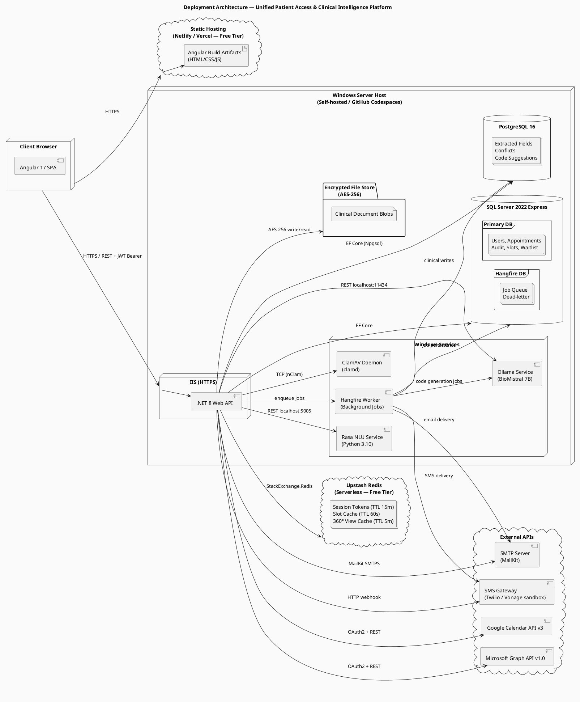

#### Enhanced Deployment Details

| Component | Specification | Source |
|-----------|---------------|--------|
| Static Host | Netlify/Vercel free tier; Angular production build; HSTS headers; HTTPS enforced | TR-017, NFR-011 |
| Web Server | IIS on Windows Server; TLS certificate; HTTPS redirect; .NET 8 in-process hosting | TR-017, NFR-004 |
| Background Jobs | Hangfire 1.8.x; SQL Server-backed queue; Admin-only dashboard; exponential backoff 3× | TR-006, NFR-009 |
| Primary DB | SQL Server 2022 Express; 10 GB limit; EF Core migrations; INSERT-only audit grants | TR-003, DR-008 |
| Clinical DB | PostgreSQL 16; Npgsql EF Core provider; separate ClinicalDbContext; no shared transactions | TR-004, DR-005–007 |
| Cache | Upstash Redis serverless free tier; 256 MB; session + slot + 360° view TTLs | TR-005, DR-010 |
| Document Store | Local encrypted filesystem; AES-256-CBC; blobs outside database; path stored in DB | TR-011, DR-005 |
| AI — OCR | Tesseract 5.x; LSTM engine; runs in Hangfire job via .NET P/Invoke | TR-007, AIR-002 |
| AI — NLU | Rasa 3.x Python service; Windows Service; localhost REST; not internet-accessible | TR-008, AIR-001 |
| AI — LLM | Ollama + BioMistral 7B Q4_K_M; ≥8 GB VRAM; Windows Service; localhost only | TR-009, AIR-003 |
| Security | ClamAV daemon (Windows Service); nClam TCP client; scan before encrypt; reject on daemon unavailable | TR-016, NFR-006 |
| Monitoring | Serilog → rolling file + Seq Community; correlation IDs; no PHI in logs | TR-018, NFR-001 |

---

### Data Flow Diagram

<!-- RENDER type="plantuml" src="./uml-models/data-flow.png" -->


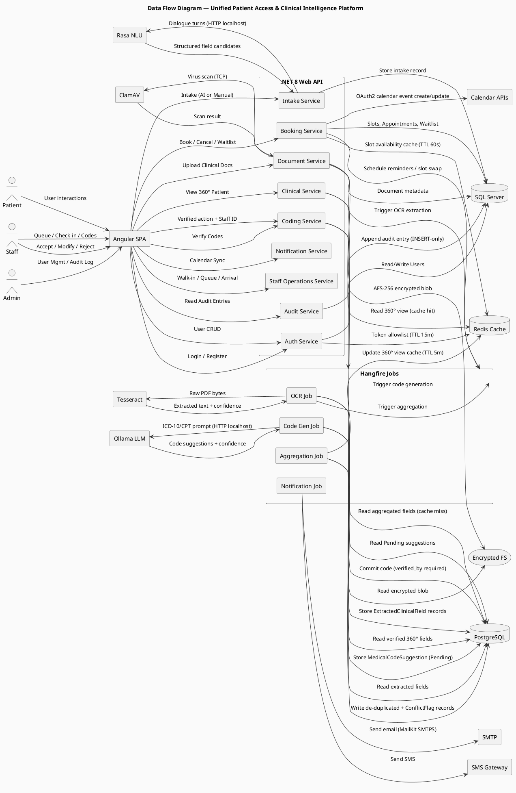

---

### Logical Data Model (ERD)

<!-- RENDER type="mermaid" src="./uml-models/logical-data-model.png" -->


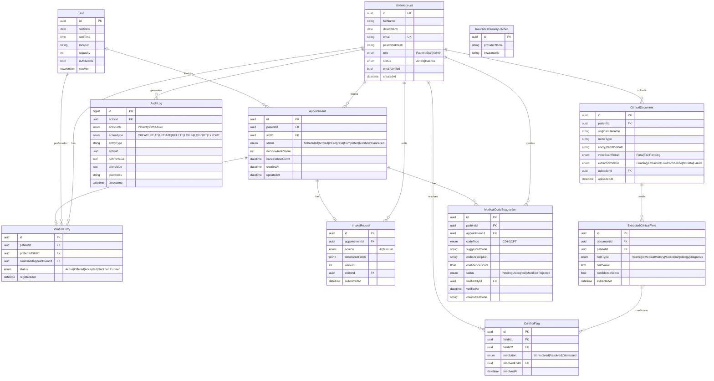

---

### AI Architecture Diagrams

#### AI Inference Pipeline Diagram

<!-- RENDER type="plantuml" src="./uml-models/ai-inference-pipeline.png" -->


```plantuml
@startuml ai-inference-pipeline
skinparam backgroundColor #FAFAFA
skinparam arrowColor #333
left to right direction

title AI Inference Pipeline — Local OSS Inference with Trust-First Gate

rectangle "Patient Upload" as PUpload
rectangle "Hangfire: OCR Job" as OcrJob
rectangle "Tesseract 5.x\n(LSTM OCR Engine)" as Tess
rectangle "Confidence Check\n(threshold: 0.75)" as ConfCheck
rectangle "ExtractedClinicalField\n(PostgreSQL)" as ECF
rectangle "LowConfidence Flag\n→ Staff Manual Review" as LowConf

rectangle "Hangfire: Aggregation Job" as AggJob
rectangle "De-duplication\n& Conflict Detection" as DedupConf
rectangle "ConflictFlag\n(PostgreSQL)" as CF
rectangle "360° View Cache\n(Upstash Redis TTL 5m)" as ViewCache

rectangle "Staff: Trigger Code Gen" as StaffTrigger
rectangle "Hangfire: Code Gen Job" as CodeJob
rectangle "Ollama\nBioMistral 7B (GGUF Q4_K_M)\nlocalhost:11434" as OllamaLLM
rectangle "MedicalCodeSuggestion\nstatus=Pending\n(PostgreSQL)" as MCSPending

rectangle "Trust-First API Gate\n(.NET Middleware)\n— requires verified_by Staff ID\n— rejects without HTTP 422" as TrustGate
rectangle "Staff: Accept/Modify/Reject" as StaffVerify
rectangle "MedicalCodeSuggestion\nstatus=Accepted|Modified|Rejected\n(PostgreSQL)" as MCSCommit

rectangle "Patient: Intake Dialogue" as PIntake
rectangle "Rasa NLU 3.x\nlocalhost:5005" as RasaNLU
rectangle "Structured Intake Fields\n(SQL Server — IntakeRecord)" as IntakeStore
rectangle "Patient Confirms Summary" as PConfirm

' OCR pipeline
PUpload --> OcrJob : document queued
OcrJob --> Tess : PDF bytes (P/Invoke)
Tess --> ConfCheck : text + page confidence
ConfCheck --> ECF : confidence ≥ 0.75 → store
ConfCheck --> LowConf : confidence < 0.75 → flag

' Aggregation pipeline
ECF --> AggJob : trigger after extraction
AggJob --> DedupConf : compare fields
DedupConf --> CF : write conflict flags
DedupConf --> ViewCache : update cache (invalidate on new doc)

' Code generation pipeline
ViewCache --> StaffTrigger : 360° view ready
StaffTrigger --> CodeJob : enqueue code gen
CodeJob --> OllamaLLM : ICD-10/CPT prompt
OllamaLLM --> MCSPending : suggestions + confidence scores

' Trust-First verification gate
MCSPending --> StaffVerify : display to Staff
StaffVerify --> TrustGate : action + verified_by Staff ID
TrustGate --> MCSCommit : validated commit

' Conversational intake pipeline
PIntake --> RasaNLU : patient utterance
RasaNLU --> PIntake : structured candidates + clarification
PIntake --> PConfirm : show structured summary
PConfirm --> IntakeStore : patient confirms → store
@enduml
```

---

#### AI Sequence Diagram — UC-008: AI Conversational Intake

**Source:** `spec.md#UC-008`

<!-- RENDER type="mermaid" src="./uml-models/ai-seq-uc-008.png" -->


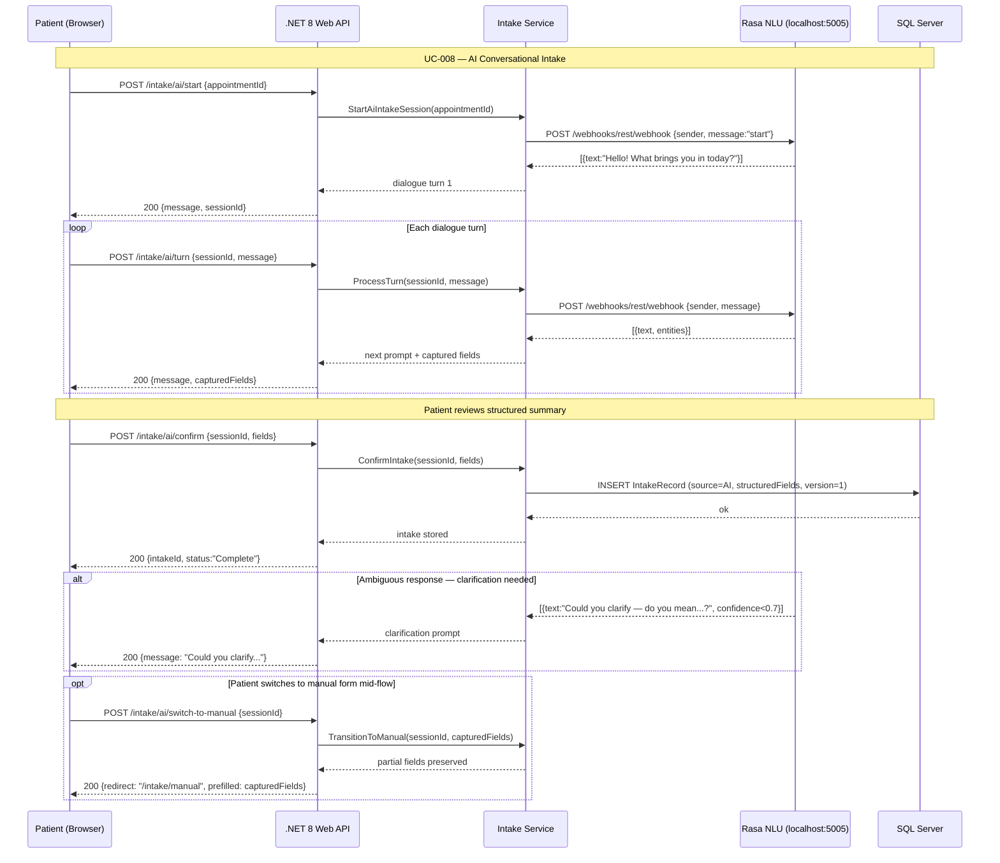

---

#### AI Sequence Diagram — UC-018: OCR Clinical Data Extraction

**Source:** `spec.md#UC-018`

<!-- RENDER type="mermaid" src="./uml-models/ai-seq-uc-018.png" -->


```mermaid
sequenceDiagram
    participant Hangfire as Hangfire Job Worker
    participant DocSvc as Document Service
    participant FS as Encrypted Filesystem
    participant Tess as Tesseract 5.x (P/Invoke)
    participant NLP as NLP Extraction Logic (.NET)
    participant PG as PostgreSQL

    Note over Hangfire,PG: UC-018 — OCR Clinical Data Extraction (background)

    Hangfire->>DocSvc: ExecuteOcrJob(documentId)
    DocSvc->>FS: ReadEncryptedBlob(documentId)
    FS-->>DocSvc: decrypted bytes
    DocSvc->>Tess: ExtractText(pdfBytes)
    Tess-->>DocSvc: {text, pageConfidences[]}

    DocSvc->>DocSvc: EvaluateConfidence(pageConfidences)

    alt All pages confidence ≥ 0.75
        DocSvc->>NLP: ExtractStructuredFields(text)
        NLP-->>DocSvc: [ExtractedClinicalField...]
        DocSvc->>PG: INSERT ExtractedClinicalField[] (status=Extracted)
        DocSvc->>PG: UPDATE ClinicalDocument status=Extracted
    else Any page confidence < 0.75
        DocSvc->>PG: INSERT ExtractedClinicalField[] (confidence scores stored)
        DocSvc->>PG: UPDATE ClinicalDocument status=LowConfidence
        Note over DocSvc,PG: Staff dashboard flagged for manual review
    end

    opt No clinical fields recognized
        DocSvc->>PG: UPDATE ClinicalDocument status=NoData
    end

    opt OCR engine unavailable (P/Invoke failure)
        DocSvc->>Hangfire: RetryWithBackoff(attempt, maxRetries=3)
        Note over Hangfire: Exponential backoff: 30s, 60s, 120s
        alt Max retries exhausted
            DocSvc->>PG: UPDATE ClinicalDocument status=Failed
            Note over DocSvc: Dead-letter queue; Staff dashboard alert
        end
    end
```

---

#### AI Sequence Diagram — UC-021: ICD-10 & CPT Code Generation

**Source:** `spec.md#UC-021`

<!-- RENDER type="mermaid" src="./uml-models/ai-seq-uc-021.png" -->


```mermaid
sequenceDiagram
    participant S as Staff (Browser)
    participant API as .NET 8 Web API
    participant CodeSvc as Coding Service
    participant Hangfire as Hangfire Job Worker
    participant PG as PostgreSQL
    participant Ollama as Ollama (BioMistral 7B) localhost:11434

    Note over S,Ollama: UC-021 — ICD-10 & CPT Code Generation

    S->>API: POST /coding/generate {patientId, appointmentId}
    API->>CodeSvc: TriggerCodeGeneration(patientId, appointmentId)
    CodeSvc->>PG: SELECT 360° verified fields (status=Verified)
    PG-->>CodeSvc: diagnosisNarratives[], procedureEntries[]
    CodeSvc->>Hangfire: EnqueueCodeGenJob(patientId, fields)
    CodeSvc-->>API: 202 Accepted {jobId}
    API-->>S: 202 {message:"Code generation queued", jobId}

    Note over Hangfire,Ollama: Async code generation job
    Hangfire->>Ollama: POST /api/chat {model:"biomistral", prompt: ICD10_TEMPLATE + narratives}
    Ollama-->>Hangfire: {message:{content: icd10Suggestions[]}}
    Hangfire->>Ollama: POST /api/chat {model:"biomistral", prompt: CPT_TEMPLATE + procedures}
    Ollama-->>Hangfire: {message:{content: cptSuggestions[]}}
    Hangfire->>PG: INSERT MedicalCodeSuggestion[] (status=Pending, confidenceScore)

    S->>API: GET /coding/suggestions {appointmentId}
    API->>PG: SELECT MedicalCodeSuggestion WHERE status=Pending
    PG-->>API: suggestions[]
    API-->>S: 200 {icd10Suggestions[], cptSuggestions[]}

    alt Confidence score below threshold (configurable, default 0.6)
        Note over Hangfire,PG: Suggestion flagged lowConfidence=true
        API-->>S: suggestions with lowConfidence flag; Staff prompted for manual review
    end

    opt Ollama service unavailable
        Hangfire->>Hangfire: RetryWithBackoff(maxRetries=3)
        alt Max retries exhausted
            Hangfire->>PG: UPDATE job status=Failed
            Note over S: Staff dashboard: "Code generation pending — engine unavailable"
        end
    end

    opt No CPT-mappable procedures
        Note over Hangfire,PG: CPT section: "No procedures identified" — no suggestion inserted
    end
```

---

#### AI Sequence Diagram — UC-022: Staff Verifies Medical Codes (Trust-First Gate)

**Source:** `spec.md#UC-022`

<!-- RENDER type="mermaid" src="./uml-models/ai-seq-uc-022.png" -->


```mermaid
sequenceDiagram
    participant S as Staff (Browser)
    participant API as .NET 8 Web API
    participant TrustGate as Trust-First API Middleware
    participant CodeSvc as Coding Service
    participant PG as PostgreSQL
    participant AuditSvc as Audit Service
    participant SQL as SQL Server (AuditLog)

    Note over S,SQL: UC-022 — Staff Verifies Medical Codes (Trust-First Gate)

    S->>API: GET /coding/suggestions {appointmentId}
    API->>PG: SELECT MedicalCodeSuggestion WHERE status=Pending
    PG-->>API: suggestions[]
    API-->>S: 200 {suggestions[]: code, description, confidence, lowConfidence}

    loop For each suggestion
        S->>API: PATCH /coding/suggestions/{id} {action, verifiedById, committedCode?}
        API->>TrustGate: ValidateVerification(verifiedById, action)
        TrustGate->>TrustGate: Assert verifiedById is non-null Staff user
        alt verifiedById present and valid
            TrustGate->>CodeSvc: ProcessVerification(id, action, verifiedById, committedCode)
            CodeSvc->>PG: UPDATE MedicalCodeSuggestion SET status=action, verifiedById, verifiedAt
            PG-->>CodeSvc: ok
            CodeSvc->>AuditSvc: LogAction(STAFF, UPDATE, MedicalCodeSuggestion, id)
            AuditSvc->>SQL: INSERT AuditLog (append-only)
            CodeSvc-->>API: 200 {suggestionId, status}
            API-->>S: 200 confirmed
        else verifiedById missing or invalid
            TrustGate-->>API: 422 Unprocessable Entity
            API-->>S: 422 {error:"Staff verification required — verifiedById must be present"}
        end
    end

    S->>API: POST /coding/complete {appointmentId, verifiedById}
    API->>CodeSvc: MarkCodingComplete(appointmentId, verifiedById)
    CodeSvc->>PG: SELECT COUNT(*) WHERE status=Pending
    alt All suggestions actioned
        PG-->>CodeSvc: count=0
        CodeSvc->>PG: UPDATE appointment coding_status=Complete
        API-->>S: 200 {message:"Coding task complete"}
    else Unreviewed suggestions remain
        PG-->>CodeSvc: count>0
        CodeSvc-->>API: 409 Conflict
        API-->>S: 409 {error:"Unreviewed suggestions remain", pendingIds[]}
    end

    opt Staff accepts all
        S->>API: POST /coding/accept-all {appointmentId, verifiedById}
        API->>TrustGate: ValidateVerification(verifiedById, "AcceptAll")
        TrustGate->>CodeSvc: AcceptAll(appointmentId, verifiedById)
        Note over CodeSvc,PG: Confirmation prompt enforced client-side; server commits all
    end
```

---

## Use Case Sequence Diagrams

### UC-001: Patient Self-Registration
**Source:** `spec.md#UC-001`

<!-- RENDER type="mermaid" src="./uml-models/seq-uc-001.png" -->


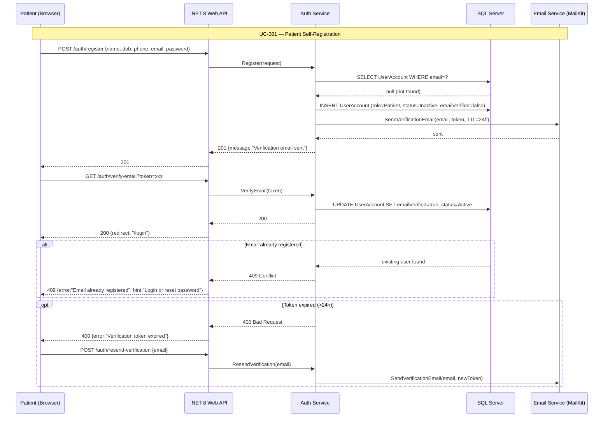

---

### UC-002: Login & Session Management
**Source:** `spec.md#UC-002`

<!-- RENDER type="mermaid" src="./uml-models/seq-uc-002.png" -->


```mermaid
sequenceDiagram
    participant U as User (Browser)
    participant API as .NET 8 Web API
    participant AuthSvc as Auth Service
    participant SQL as SQL Server
    participant Redis as Upstash Redis

    Note over U,Redis: UC-002 — Login & Session Management

    U->>API: POST /auth/login {email, password}
    API->>AuthSvc: Login(email, password)
    AuthSvc->>SQL: SELECT UserAccount WHERE email=?
    SQL-->>AuthSvc: user record
    AuthSvc->>AuthSvc: VerifyPassword(hash)
    AuthSvc->>AuthSvc: GenerateJWT(userId, role, exp=15min)
    AuthSvc->>Redis: SET token:{jti} userId EX 900
    AuthSvc-->>API: 200 {jwt, role}
    API-->>U: 200 {token, dashboard-redirect}

    Note over U,Redis: Session activity monitoring
    U->>API: Any authenticated request (Authorization: Bearer jwt)
    API->>Redis: GET token:{jti}
    alt Token in Redis (valid session)
        Redis-->>API: userId
        API->>Redis: EXPIRE token:{jti} 900 (reset TTL)
        API-->>U: 200 response
    else Token not in Redis (expired or logged out)
        Redis-->>API: nil
        API-->>U: 401 Unauthorized
    end

    alt Invalid credentials
        AuthSvc-->>API: 401 {error:"Invalid credentials"}
        Note over AuthSvc: Increment failure counter; lock after 5 failures for 15min
    end

    opt Cross-role URL access attempt
        API->>API: CheckRoleAuthorization(token.role, endpoint.requiredRole)
        API-->>U: 403 Forbidden
    end
```

---

### UC-003: Admin User Account Management
**Source:** `spec.md#UC-003`

<!-- RENDER type="mermaid" src="./uml-models/seq-uc-003.png" -->


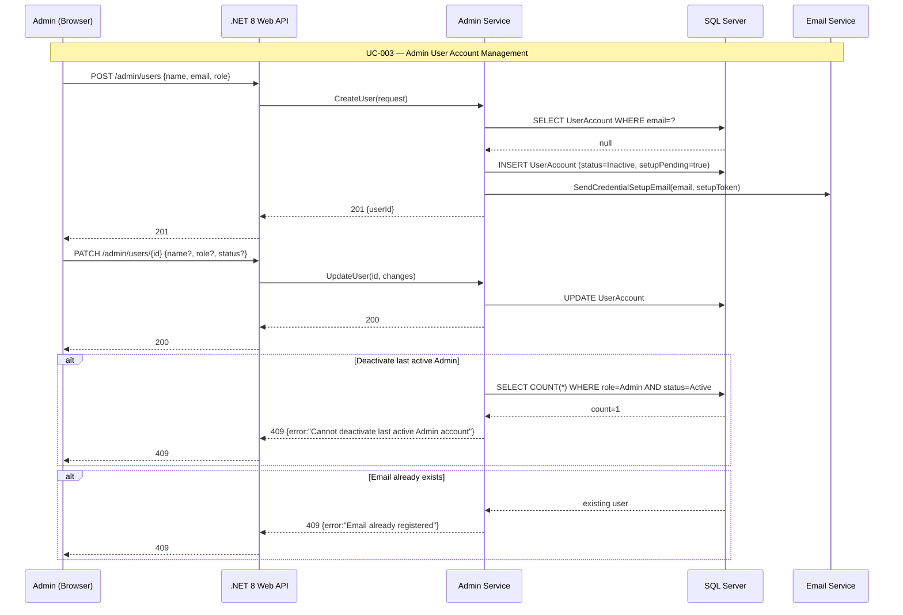

---

### UC-004: Patient Books Available Appointment
**Source:** `spec.md#UC-004`

<!-- RENDER type="mermaid" src="./uml-models/seq-uc-004.png" -->


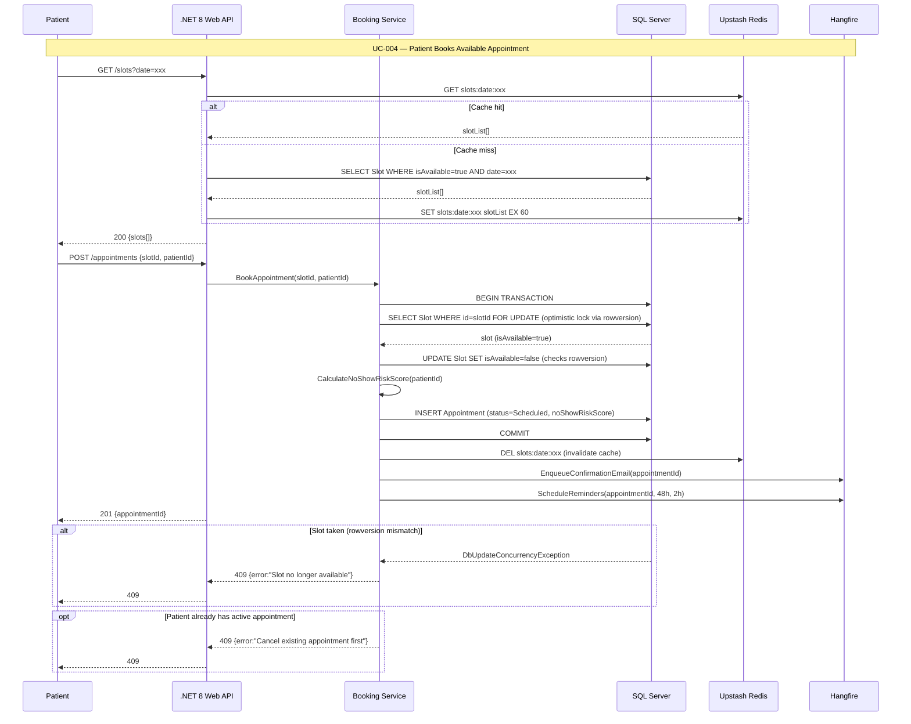

---

### UC-005: Patient Joins Waitlist for Preferred Slot
**Source:** `spec.md#UC-005`

<!-- RENDER type="mermaid" src="./uml-models/seq-uc-005.png" -->


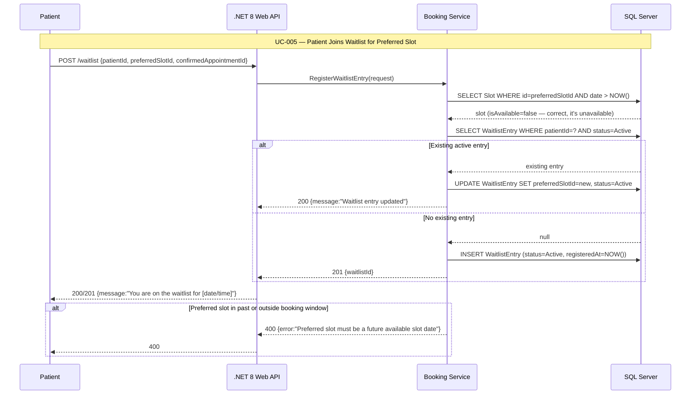

---

### UC-006: System Executes Preferred Slot Swap
**Source:** `spec.md#UC-006`

<!-- RENDER type="mermaid" src="./uml-models/seq-uc-006.png" -->


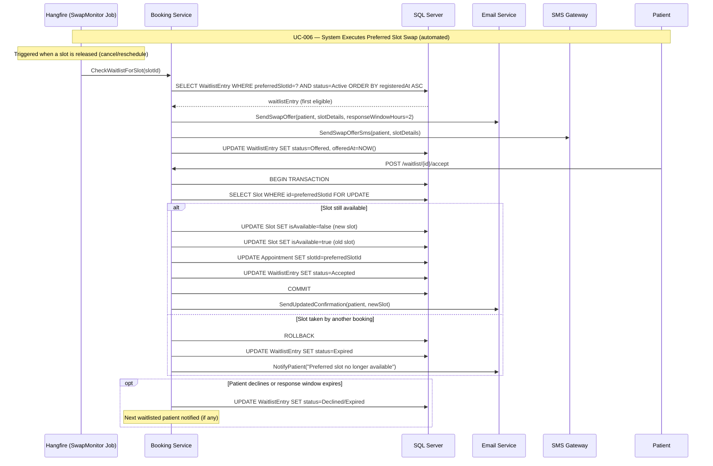

---

### UC-007: Patient Cancels or Reschedules Appointment
**Source:** `spec.md#UC-007`

<!-- RENDER type="mermaid" src="./uml-models/seq-uc-007.png" -->


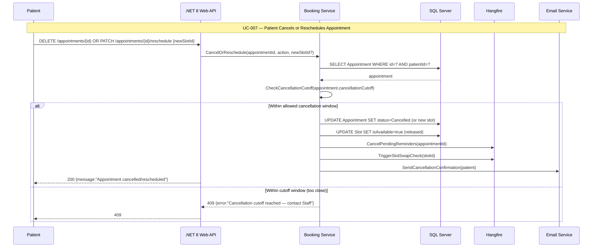

---

### UC-008: Patient Completes Manual Intake Form
**Source:** `spec.md#UC-009`

<!-- RENDER type="mermaid" src="./uml-models/seq-uc-009.png" -->


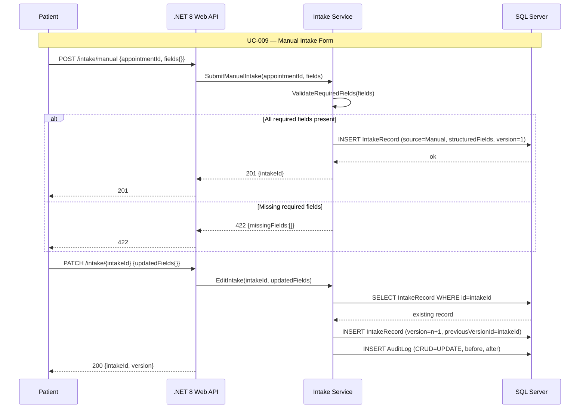

---

### UC-010: Insurance Pre-Check
**Source:** `spec.md#UC-010`

<!-- RENDER type="mermaid" src="./uml-models/seq-uc-010.png" -->


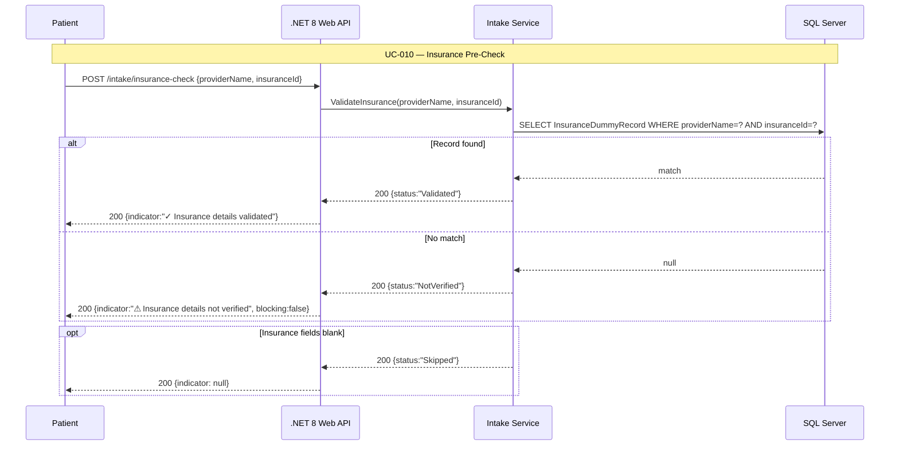

---

### UC-011: Appointment Reminders & Confirmation
**Source:** `spec.md#UC-011`

<!-- RENDER type="mermaid" src="./uml-models/seq-uc-011.png" -->


```mermaid
sequenceDiagram
    participant Hangfire as Hangfire Job Worker
    participant NotifSvc as Notification Service
    participant PDF as QuestPDF
    participant Email as MailKit (SMTP)
    participant SMS as SMS Gateway

    Note over Hangfire,SMS: UC-011 — Appointment Reminders & Confirmation

    Note over Hangfire: Triggered immediately after booking confirmation
    Hangfire->>NotifSvc: SendConfirmationEmail(appointmentId)
    NotifSvc->>PDF: GeneratePdf(appointmentDetails)
    PDF-->>NotifSvc: pdfBytes (<500ms)
    NotifSvc->>Email: Send(to, subject, body, attachment=pdfBytes)
    Email-->>NotifSvc: sent

    Note over Hangfire: Scheduled job fires at T-48h
    Hangfire->>NotifSvc: Send48hReminder(appointmentId)
    NotifSvc->>Email: Send(reminder email + cancel link)
    NotifSvc->>SMS: Send(reminder SMS)

    Note over Hangfire: Scheduled job fires at T-2h
    Hangfire->>NotifSvc: Send2hReminder(appointmentId)
    NotifSvc->>Email: Send(reminder email)
    NotifSvc->>SMS: Send(reminder SMS)

    opt PDF generation fails
        PDF-->>NotifSvc: exception
        Note over NotifSvc: Retry up to 3 times; then send email without PDF; log failure
    end

    opt SMS gateway unavailable
        SMS-->>NotifSvc: timeout/error
        Hangfire->>Hangfire: RetryWithBackoff(maxRetries=3)
        Note over NotifSvc: Email proceeds independently
    end

    opt Appointment cancelled before reminder fires
        Hangfire->>Hangfire: CancelJob(reminder jobId)
        Note over Hangfire: Pending reminder jobs deleted
    end
```

---

### UC-012: Patient Syncs Appointment to Calendar
**Source:** `spec.md#UC-012`

<!-- RENDER type="mermaid" src="./uml-models/seq-uc-012.png" -->


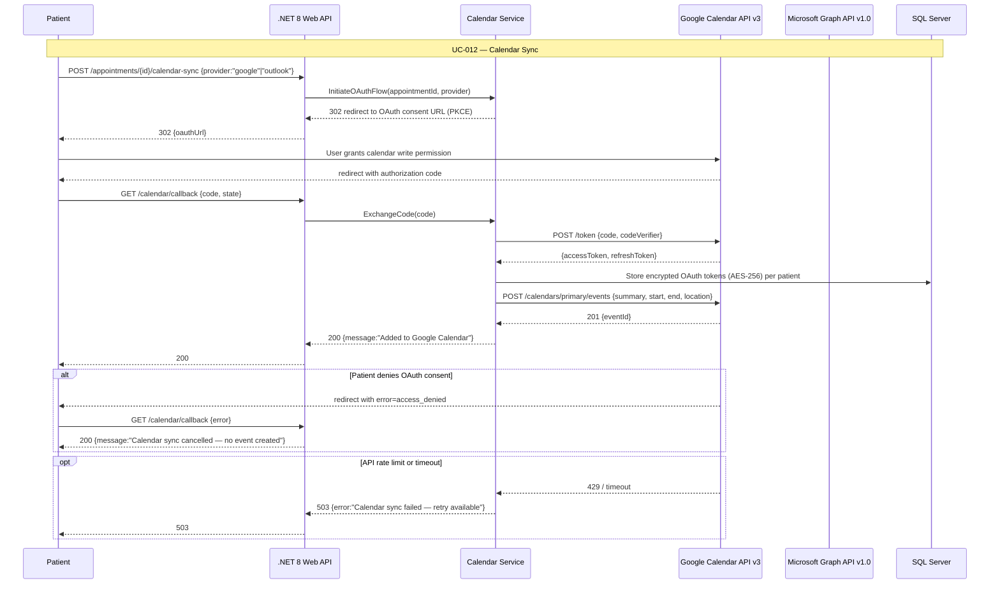

---

### UC-013: Staff Registers Walk-In Patient
**Source:** `spec.md#UC-013`

<!-- RENDER type="mermaid" src="./uml-models/seq-uc-013.png" -->


```mermaid
sequenceDiagram
    participant S as Staff
    participant API as .NET 8 Web API
    participant StaffSvc as Staff Operations Service
    participant SQL as SQL Server
    participant AuditSvc as Audit Service

    Note over S,AuditSvc: UC-013 — Staff Registers Walk-In Patient

    S->>API: GET /patients/search?q=name/dob
    API->>StaffSvc: SearchPatient(query)
    StaffSvc->>SQL: SELECT UserAccount WHERE name LIKE ? OR dob=?
    SQL-->>StaffSvc: results[]
    API-->>S: 200 {patients[]}

    S->>API: POST /queue/walkin {patientId OR newPatient{}, staffId}
    API->>StaffSvc: RegisterWalkIn(patientId, staffId)
    StaffSvc->>SQL: SELECT COUNT(*) FROM SameDayQueue WHERE date=TODAY()
    alt Queue below capacity
        StaffSvc->>SQL: INSERT QueueEntry (patientId, walkInFlag=true, enteredAt=NOW())
        StaffSvc->>AuditSvc: Log(STAFF, CREATE, QueueEntry, staffId)
        API-->>S: 201 {queuePosition}
    else Queue at capacity
        StaffSvc-->>API: 409 {error:"Queue at capacity", canOverride:true}
        S->>API: POST /queue/walkin {override:true}
        StaffSvc->>SQL: INSERT QueueEntry (overrideFlag=true)
        API-->>S: 201 {queuePosition, note:"Capacity override applied"}
    end

    opt New minimal patient profile needed
        S->>API: POST /patients/minimal {name, dob, contact}
        API->>StaffSvc: CreateMinimalProfile(data)
        StaffSvc->>SQL: INSERT UserAccount (status=Active, needsFullRegistration=true)
        API-->>S: 201 {patientId}
    end
```

---

### UC-014: Staff Manages Same-Day Queue
**Source:** `spec.md#UC-014`

<!-- RENDER type="mermaid" src="./uml-models/seq-uc-014.png" -->


```mermaid
sequenceDiagram
    participant S as Staff
    participant API as .NET 8 Web API
    participant StaffSvc as Staff Operations Service
    participant SQL as SQL Server

    Note over S,SQL: UC-014 — Staff Manages Same-Day Queue

    S->>API: GET /queue/today
    API->>StaffSvc: GetTodayQueue()
    StaffSvc->>SQL: SELECT QueueEntry WHERE date=TODAY() ORDER BY position ASC
    SQL-->>StaffSvc: queueEntries[]
    StaffSvc->>StaffSvc: CalculateEstimatedWaits(queueEntries)
    API-->>S: 200 {queue[]: position, patient, estimatedWait, walkInFlag}

    S->>API: PATCH /queue/reorder {newOrder:[]}
    API->>StaffSvc: ReorderQueue(newOrder)
    StaffSvc->>SQL: UPDATE QueueEntry positions (optimistic lock check)
    alt No concurrent conflict
        SQL-->>StaffSvc: ok
        StaffSvc-->>API: 200 {queue[]}
    else Concurrent edit conflict
        SQL-->>StaffSvc: conflict (stale data)
        StaffSvc-->>API: 409 {error:"Queue updated by another user — please refresh"}
        API-->>S: 409
    end

    S->>API: DELETE /queue/{entryId}
    API->>StaffSvc: RemoveFromQueue(entryId)
    StaffSvc->>SQL: DELETE QueueEntry WHERE id=entryId
    StaffSvc->>SQL: Reorder remaining positions
    API-->>S: 200
```

---

### UC-015: Staff Checks In Patient Arrival
**Source:** `spec.md#UC-015`

<!-- RENDER type="mermaid" src="./uml-models/seq-uc-015.png" -->


```mermaid
sequenceDiagram
    participant S as Staff
    participant API as .NET 8 Web API
    participant StaffSvc as Staff Operations Service
    participant SQL as SQL Server
    participant AuditSvc as Audit Service

    Note over S,AuditSvc: UC-015 — Staff Checks In Patient Arrival

    S->>API: PATCH /appointments/{id}/checkin {staffId}
    API->>StaffSvc: CheckInPatient(appointmentId, staffId)
    StaffSvc->>SQL: SELECT Appointment WHERE id=? AND status=Scheduled
    SQL-->>StaffSvc: appointment
    StaffSvc->>SQL: UPDATE Appointment SET status=Arrived, arrivedAt=NOW()
    StaffSvc->>SQL: DELETE QueueEntry WHERE appointmentId=? (auto-remove from queue)
    StaffSvc->>AuditSvc: Log(STAFF, UPDATE, Appointment, staffId, before=Scheduled, after=Arrived)
    AuditSvc->>SQL: INSERT AuditLog
    API-->>S: 200 {appointmentId, status:"Arrived"}

    alt Appointment already Arrived
        SQL-->>StaffSvc: status=Arrived
        StaffSvc-->>API: 409 {error:"Already checked in", canConfirm:true}
        S->>API: PATCH /appointments/{id}/checkin {staffId, forceOverride:true}
        StaffSvc->>AuditSvc: Log(STAFF, UPDATE, Appointment, override=true)
        API-->>S: 200
    end

    opt Patient not found in schedule
        StaffSvc-->>API: 404
        API-->>S: 404 {hint:"Register as walk-in"}
    end
```

---

### UC-016: Staff Reviews No-Show Risk Alerts
**Source:** `spec.md#UC-016`

<!-- RENDER type="mermaid" src="./uml-models/seq-uc-016.png" -->


```mermaid
sequenceDiagram
    participant S as Staff
    participant API as .NET 8 Web API
    participant StaffSvc as Staff Operations Service
    participant SQL as SQL Server

    Note over S,SQL: UC-016 — Staff Reviews No-Show Risk Alerts

    S->>API: GET /schedule/today?filter=high-risk
    API->>StaffSvc: GetHighRiskAppointments(date=TODAY())
    StaffSvc->>SQL: SELECT Appointment WHERE date=TODAY() AND noShowRiskScore >= threshold
    SQL-->>StaffSvc: appointments[]
    API-->>S: 200 {appointments[]: patient, time, riskScore, riskFlag}

    S->>API: PATCH /appointments/{id}/outreach {note, staffId}
    API->>StaffSvc: RecordOutreach(appointmentId, note, staffId)
    StaffSvc->>SQL: UPDATE Appointment SET outreachNote=note, outreachBy=staffId
    API-->>S: 200

    opt Mark no-show
        S->>API: PATCH /appointments/{id}/status {status:"NoShow", staffId}
        API->>StaffSvc: UpdateStatus(appointmentId, NoShow, staffId)
        StaffSvc->>SQL: UPDATE Appointment SET status=NoShow
        Note over StaffSvc: No-show history factored into future risk score calculations
        API-->>S: 200
    end

    opt No high-risk appointments
        StaffSvc-->>API: 200 {appointments:[], message:"No high-risk appointments today"}
    end
```

---

### UC-017: Patient Uploads Clinical Documents
**Source:** `spec.md#UC-017`

<!-- RENDER type="mermaid" src="./uml-models/seq-uc-017.png" -->


```mermaid
sequenceDiagram
    participant P as Patient
    participant API as .NET 8 Web API
    participant DocSvc as Document Service
    participant ClamAV as ClamAV (nClam)
    participant FS as Encrypted Filesystem
    participant SQL as SQL Server
    participant Hangfire as Hangfire

    Note over P,Hangfire: UC-017 — Patient Uploads Clinical Documents

    P->>API: POST /documents/upload {file (multipart), patientId}
    API->>DocSvc: HandleUpload(file, patientId)
    DocSvc->>DocSvc: ValidateFileType(mimeType) — PDF allowed
    DocSvc->>DocSvc: ValidateFileSize(bytes <= configuredLimit)

    DocSvc->>ClamAV: ScanStream(fileStream)
    ClamAV-->>DocSvc: scanResult {clean/infected}

    alt File clean
        DocSvc->>DocSvc: EncryptAES256(fileBytes, key)
        DocSvc->>FS: WriteEncryptedBlob(encryptedBytes, path)
        DocSvc->>SQL: INSERT ClinicalDocument (path, status=Pending, virusScan=Pass)
        DocSvc->>Hangfire: EnqueueOcrJob(documentId)
        API-->>P: 201 {documentId, status:"Uploaded"}
    else File infected
        DocSvc->>SQL: INSERT ClinicalDocument (status=Rejected, virusScan=Fail)
        API-->>P: 422 {error:"File rejected — malware detected"}
    end

    opt ClamAV daemon unreachable
        ClamAV-->>DocSvc: connection error
        API-->>P: 503 {error:"Virus scan service unavailable — upload rejected"}
        Note over DocSvc: Silent bypass of scan is not permitted (TR-016)
    end

    opt Unsupported file format
        DocSvc-->>API: 415 {error:"Unsupported format", supported:["application/pdf"]}
        API-->>P: 415
    end
```

---

### UC-018: System Ingests and Extracts Clinical Data
**Source:** `spec.md#UC-018`

<!-- RENDER type="mermaid" src="./uml-models/seq-uc-018.png" -->


```mermaid
sequenceDiagram
    participant Hangfire as Hangfire (OCR Job)
    participant DocSvc as Document Service
    participant FS as Encrypted Filesystem
    participant Tess as Tesseract 5.x
    participant NLP as NLP Extraction
    participant PG as PostgreSQL

    Note over Hangfire,PG: UC-018 — Clinical Data Ingestion & Extraction (async)

    Hangfire->>DocSvc: ExecuteOcrJob(documentId)
    DocSvc->>FS: ReadAndDecryptBlob(documentId)
    FS-->>DocSvc: pdfBytes
    DocSvc->>Tess: ExtractText(pdfBytes)
    Tess-->>DocSvc: {fullText, pageConfidences[]}
    DocSvc->>NLP: ExtractFields(fullText)
    NLP-->>DocSvc: fields[] with fieldType, value, confidence

    alt confidence >= 0.75 for all pages
        DocSvc->>PG: INSERT ExtractedClinicalField[] (status=Extracted)
        DocSvc->>PG: UPDATE ClinicalDocument SET extractionStatus=Extracted
    else any page confidence < 0.75
        DocSvc->>PG: INSERT ExtractedClinicalField[] (confidence stored)
        DocSvc->>PG: UPDATE ClinicalDocument SET extractionStatus=LowConfidence
    end

    opt No clinical fields found
        DocSvc->>PG: UPDATE ClinicalDocument SET extractionStatus=NoData
    end

    opt OCR failure (retries exhausted)
        DocSvc->>PG: UPDATE ClinicalDocument SET extractionStatus=Failed
    end
```

---

### UC-019: System Detects and Flags Data Conflicts
**Source:** `spec.md#UC-019`

<!-- RENDER type="mermaid" src="./uml-models/seq-uc-019.png" -->


```mermaid
sequenceDiagram
    participant Hangfire as Hangfire (Aggregation Job)
    participant AggSvc as Aggregation Service
    participant PG as PostgreSQL
    participant Redis as Upstash Redis
    participant S as Staff

    Note over Hangfire,S: UC-019 — Data De-Duplication & Conflict Detection

    Hangfire->>AggSvc: ExecuteAggregationJob(patientId)
    AggSvc->>PG: SELECT ExtractedClinicalField WHERE patientId=? ORDER BY extractedAt DESC
    PG-->>AggSvc: fields[]
    AggSvc->>AggSvc: DeduplicateByFieldType(fields) — retain most recent non-conflicting

    AggSvc->>AggSvc: DetectConflicts(fields)
    alt Conflicts found (same field type, different values)
        AggSvc->>PG: INSERT ConflictFlag (fieldId1, fieldId2, resolution=Unresolved)
        AggSvc->>PG: UPDATE 360View status=RequiresReview
    else No conflicts
        AggSvc->>PG: UPDATE 360View status=ReadyForReview
    end
    AggSvc->>Redis: INVALIDATE 360_view:{patientId}

    S->>AggSvc: PATCH /conflicts/{id}/resolve {selectedFieldId, staffId}
    AggSvc->>PG: UPDATE ConflictFlag SET resolution=Resolved, resolvedById=staffId
    AggSvc->>PG: INSERT AuditLog (Staff resolved conflict)
    AggSvc-->>S: 200

    opt Staff dismisses without resolution
        S->>AggSvc: PATCH /conflicts/{id}/dismiss {staffId}
        AggSvc->>PG: UPDATE ConflictFlag SET resolution=Dismissed
        Note over AggSvc: Flag remains visible; dismissal logged
    end
```

---

### UC-020: Staff Reviews 360° Patient View
**Source:** `spec.md#UC-020`

<!-- RENDER type="mermaid" src="./uml-models/seq-uc-020.png" -->


```mermaid
sequenceDiagram
    participant S as Staff
    participant API as .NET 8 Web API
    participant ClinSvc as Clinical Service
    participant Redis as Upstash Redis
    participant PG as PostgreSQL

    Note over S,PG: UC-020 — Staff Reviews 360° Patient View

    S->>API: GET /patients/{id}/360-view
    API->>ClinSvc: Get360View(patientId)
    ClinSvc->>Redis: GET 360_view:{patientId}
    alt Cache hit
        Redis-->>ClinSvc: cachedView
        ClinSvc-->>API: 200 {view, status, conflictFlags[]}
    else Cache miss
        ClinSvc->>PG: SELECT de-duplicated fields + conflict flags
        PG-->>ClinSvc: view data
        ClinSvc->>Redis: SET 360_view:{patientId} view EX 300
        ClinSvc-->>API: 200 {view, status, conflictFlags[]}
    end
    API-->>S: 200

    S->>API: PATCH /patients/{id}/360-view/verify {staffId}
    API->>ClinSvc: MarkVerified(patientId, staffId)
    ClinSvc->>PG: SELECT COUNT(*) FROM ConflictFlag WHERE patientId=? AND resolution=Unresolved
    alt No unresolved conflicts
        PG-->>ClinSvc: count=0
        ClinSvc->>PG: UPDATE 360View SET status=Verified, verifiedById=staffId
        API-->>S: 200 {status:"Verified"}
    else Unresolved conflicts remain
        PG-->>ClinSvc: count>0
        ClinSvc-->>API: 409 {error:"Resolve all critical conflicts before verifying"}
        API-->>S: 409
    end

    opt No documents on file
        ClinSvc-->>API: 200 {view:null, message:"No clinical documents on file"}
        API-->>S: 200 {hint:"Upload documents to begin extraction"}
    end
```

---

### UC-021: ICD-10 & CPT Code Generation
**Source:** `spec.md#UC-021`

*Covered in full detail in AI Sequence Diagram AI-SQ-021 above. Summary flow below.*

<!-- RENDER type="mermaid" src="./uml-models/seq-uc-021.png" -->


```mermaid
sequenceDiagram
    participant S as Staff
    participant API as .NET 8 Web API
    participant CodeSvc as Coding Service
    participant Hangfire as Hangfire
    participant PG as PostgreSQL

    Note over S,PG: UC-021 — ICD-10 & CPT Code Generation (summary)

    S->>API: POST /coding/generate {patientId, appointmentId}
    API->>CodeSvc: TriggerCodeGeneration(patientId)
    CodeSvc->>PG: Verify 360° view status=Verified
    CodeSvc->>Hangfire: EnqueueCodeGenJob(patientId)
    API-->>S: 202 {jobId, message:"Code generation queued"}

    Hangfire->>PG: Store MedicalCodeSuggestion[] (status=Pending)

    S->>API: GET /coding/suggestions {appointmentId}
    PG-->>API: suggestions[]
    API-->>S: 200 {icd10[], cpt[]}

    opt Engine unavailable after 3 retries
        API-->>S: Staff dashboard: "Code generation pending"
    end
```

---

### UC-022: Staff Verifies Medical Codes
**Source:** `spec.md#UC-022`

*Covered in full detail in AI Sequence Diagram AI-SQ-022 above. Summary flow below.*

<!-- RENDER type="mermaid" src="./uml-models/seq-uc-022.png" -->


```mermaid
sequenceDiagram
    participant S as Staff
    participant API as .NET 8 Web API
    participant TrustGate as Trust-First Middleware
    participant PG as PostgreSQL

    Note over S,PG: UC-022 — Staff Verifies Medical Codes (summary)

    S->>API: PATCH /coding/suggestions/{id} {action, verifiedById}
    API->>TrustGate: ValidateVerification(verifiedById)
    TrustGate->>PG: Commit code with verifiedById
    API-->>S: 200

    opt Missing verifiedById
        TrustGate-->>API: 422
        API-->>S: 422 {error:"Staff verification required"}
    end
```

---

### UC-023: Admin Reviews Audit Log
**Source:** `spec.md#UC-023`

<!-- RENDER type="mermaid" src="./uml-models/seq-uc-023.png" -->


```mermaid
sequenceDiagram
    participant A as Admin
    participant API as .NET 8 Web API
    participant AuditSvc as Audit Service
    participant SQL as SQL Server

    Note over A,SQL: UC-023 — Admin Reviews Audit Log

    A->>API: GET /audit?dateFrom=&dateTo=&actor=&action=&page=1
    API->>AuditSvc: QueryAuditLog(filters)
    AuditSvc->>SQL: SELECT AuditLog WHERE filters ORDER BY timestamp DESC LIMIT 50 OFFSET n
    SQL-->>AuditSvc: entries[], totalCount
    AuditSvc-->>API: 200 {entries[], pagination}
    API-->>A: 200

    A->>API: GET /audit/export?dateFrom=&dateTo=
    API->>AuditSvc: ExportAuditLog(filters)
    AuditSvc->>AuditSvc: EstimateRowCount(filters)
    alt <= 10,000 rows
        AuditSvc->>SQL: SELECT all matching rows
        AuditSvc->>AuditSvc: GenerateCsv(rows)
        API-->>A: 200 {file: csv attachment}
    else > 10,000 rows
        AuditSvc->>Hangfire: EnqueueAsyncExport(filters, adminId)
        API-->>A: 202 {message:"Export queued — you will be notified when ready"}
    end

    opt Attempt to modify/delete audit entry
        A->>API: DELETE /audit/{id} or PATCH /audit/{id}
        API-->>A: 405 Method Not Allowed
        AuditSvc->>SQL: INSERT AuditLog (attempted modification — itself logged)
    end
```

---

### UC-024: System Handles Session Timeout
**Source:** `spec.md#UC-024`

<!-- RENDER type="mermaid" src="./uml-models/seq-uc-024.png" -->


```mermaid
sequenceDiagram
    participant U as User (Any Role)
    participant SPA as Angular SPA
    participant API as .NET 8 Web API
    participant Redis as Upstash Redis

    Note over U,Redis: UC-024 — System Handles Session Timeout

    Note over SPA: Frontend timer: warns at T-2min before 15min mark
    SPA->>SPA: StartInactivityTimer(900s)
    SPA->>SPA: WarnAt(780s): "Session expiring in 2 minutes"
    U->>SPA: Click "Extend Session"
    SPA->>API: POST /auth/extend-session (Bearer jwt)
    API->>Redis: EXPIRE token:{jti} 900
    Redis-->>API: ok
    API-->>SPA: 200 {message:"Session extended"}

    alt User inactive — timeout fires
        SPA->>SPA: Timer reaches 900s
        SPA->>API: Any request (stale JWT)
        API->>Redis: GET token:{jti}
        Redis-->>API: nil (expired TTL)
        API-->>SPA: 401 Unauthorized
        SPA->>SPA: Redirect to /login?reason=timeout
        SPA-->>U: Login page with "Session expired" message
    end

    opt In-flight request at timeout boundary
        API->>Redis: GET token:{jti}
        Redis-->>API: nil
        API-->>SPA: 401
        Note over SPA: Any state-changing operation rejected; read-only cache may still serve
    end
```
