# Requirements Specification

## Feature Goal

Build a **Unified Patient Access & Clinical Intelligence Platform** — a standalone, end-to-end healthcare operations system that replaces fragmented, manual workflows with a single integrated product.

**Current state:** Healthcare organizations operate disconnected systems: appointment booking is handled separately from clinical data management, no-show mitigation is manual and reactive, and clinical staff spend 20+ minutes per patient manually extracting structured data from unstructured PDF reports before each visit.

**End state:** A unified platform where patients self-book appointments with smart waitlist logic, staff control all arrival and queue operations from a single dashboard, automated reminders and calendar sync reduce no-shows, and an AI-powered clinical intelligence engine transforms uploaded patient documents into a verified 360° patient view with ICD-10/CPT codes — reducing clinical prep time from 20 minutes to 2 minutes.

---

## Business Justification

- **Revenue protection:** Up to 15% no-show rates cause direct revenue loss and schedule underutilization; automated reminders, risk scoring, and dynamic slot swap target measurable reduction in missed appointments.
- **Clinical efficiency:** Manual data extraction from multi-format PDFs is the primary pre-visit bottleneck; AI-assisted aggregation with human verification reduces staff effort by ~90% per patient record.
- **Trust-first AI design:** Unlike black-box AI tools, the platform surfaces source attribution and requires human verification of all AI-generated codes and extractions — directly addressing the trust deficit that blocks clinical AI adoption.
- **Centralized staff control:** All check-ins and queue management are staff-owned, ensuring compliance with clinic workflows and removing patient self-service ambiguity.
- **Market differentiation:** No existing solution combines booking, waitlist logic, no-show risk scoring, clinical document aggregation, and medical coding in a single open-source-deployable product.

---

## Feature Scope

The platform serves three roles — **Patient**, **Staff (front desk/call center)**, and **Admin (user management)** — across eight functional modules:

1. **User Management** — Registration, login, role-based access, session control, and audit logging.
2. **Appointment Booking & Scheduling** — Slot selection, waitlist with auto-swap, no-show risk scoring, cancellation and reschedule.
3. **Patient Intake** — AI conversational or manual form intake, editable prior to appointment.
4. **Insurance Pre-Check** — Soft validation of insurance name and ID.
5. **Staff Operations** — Walk-in registration, same-day queue management, patient arrival check-in, daily schedule view.
6. **Notifications & Reminders** — Automated SMS/email reminders, PDF confirmation emails, Google/Outlook calendar sync.
7. **Clinical Document Management** — Secure patient document upload and encrypted storage.
8. **Clinical Data Aggregation & Medical Coding** — OCR extraction, data de-duplication, conflict detection, 360° view, ICD-10 and CPT mapping with staff verification.

**Out of scope (Phase 1):** Provider logins, payment processing, family member profiles, patient self-check-in, direct EHR integration, claims submission, paid cloud infrastructure.

**Technology stack:** Angular (UI), .NET 8 ASP.NET Core Web API (backend), SQL Server (data), deployable on Netlify/Vercel/GitHub Codespaces, Windows Services/IIS, PostgreSQL for structured data, Upstash Redis for caching.

### Success Criteria

- [ ] No-show rate measurably reduced versus baseline within 90 days of go-live.
- [ ] Clinical prep time per patient reduced to ≤2 minutes (from 20+ minutes baseline).
- [ ] AI-Human Agreement Rate for extracted clinical data and codes ≥ 98%.
- [ ] Platform uptime ≥ 99.9%.
- [ ] 100% HIPAA-compliant data handling verified by audit log completeness.
- [ ] All patient actions require Staff-initiated check-in — zero self-check-in incidents.
- [ ] Appointment confirmation PDF delivered via email within 60 seconds of booking confirmation.
- [ ] Session inactivity timeout enforced at exactly 15 minutes for all authenticated roles.

---

## Functional Requirements

### User Management

- FR-001: [SOURCE:INPUT] System MUST allow patients to self-register by providing name, date of birth, contact details, and a verified email address, creating a persistent patient profile.
  Basis: BRD §6 "User Roles: Patients" and platform scope requiring patient-facing booking access.

- FR-002: [SOURCE:INPUT] System MUST allow Admin users to create, edit, deactivate, and reactivate Staff and Admin accounts with assigned roles.
  Basis: BRD §6 "User Roles: Admin (user management)".

- FR-003: [SOURCE:INPUT] System MUST enforce role-based access control (RBAC) such that Patients access only patient-facing features, Staff access only operational dashboards, and Admins access only user management functions; cross-role access MUST be denied.
  Basis: BRD §7 "role-based access" under Security & Compliance.

- FR-004: [SOURCE:INPUT] System MUST terminate authenticated sessions after 15 minutes of inactivity and require re-authentication before resuming any action.
  Basis: BRD §7 "robust session management (15-minute timeout)".

- FR-005: [SOURCE:INPUT] System MUST write an immutable, timestamped audit log entry for every create, read, update, and delete action performed by any authenticated user, capturing actor identity, action type, affected record, and timestamp; audit entries MUST NOT be editable or deletable by any role.
  Basis: BRD §7 "immutable audit logging" and HIPAA compliance requirement.

- FR-006: [SOURCE:INFERRED] System MUST provide a password-reset flow triggered by verified email token, invalidating the token after first use and expiring it after 60 minutes.
  Basis: Standard HIPAA-aligned credential recovery; implied by secure authentication requirement and patient self-service registration.

---

### Appointment Booking & Scheduling

- FR-007: [SOURCE:INPUT] System MUST present patients with a calendar view of available appointment slots and allow selection and confirmation of a single upcoming appointment.
  Basis: BRD §6 "Booking & Reminders: Appointment booking".

- FR-008: [SOURCE:INPUT] System MUST allow a patient, at the time of booking, to register a preferred unavailable slot on a waitlist; only one active waitlist entry per patient is permitted.
  Basis: BRD §4 "Dynamic Preferred Slot Swap" and §3 "appointment booking with waitlist".

- FR-009: [SOURCE:INPUT] System MUST automatically swap a patient's confirmed appointment to their registered preferred slot when that slot becomes available, notifying the patient of the change before the swap is applied; the patient MUST be able to decline the swap within a configurable window (default 2 hours).
  Basis: BRD §4 "Dynamic Preferred Slot Swap — if the preferred slot opens, the system automatically swaps appointments".

- FR-010: [SOURCE:INPUT] System MUST calculate and assign a no-show risk score to each appointment at booking time using rule-based logic (e.g., prior no-show history, booking lead time, intake completion status) and display the score to Staff.
  Basis: BRD §3 "rule-based no-show risk assessment".

- FR-011: [SOURCE:INPUT] System MUST allow patients to cancel or reschedule an existing upcoming appointment up to a configurable cutoff time before the appointment, releasing the slot back to the available pool.
  Basis: BRD §6 "Booking & Reminders: Appointment booking with waitlist".

- FR-012: [SOURCE:INPUT] System MUST provide a one-click action to sync a confirmed appointment to the patient's Google Calendar using the Google Calendar free API, creating a calendar event with appointment date, time, location, and provider name.
  Basis: BRD §6 "Google/Outlook calendar sync via free APIs".

- FR-013: [SOURCE:INPUT] System MUST provide a one-click action to sync a confirmed appointment to the patient's Outlook Calendar using the Microsoft Graph free-tier API, creating a calendar event with appointment date, time, location, and provider name.
  Basis: BRD §6 "Google/Outlook calendar sync via free APIs".

- FR-014: [SOURCE:INPUT] System MUST send an appointment confirmation email containing a PDF attachment with full appointment details (date, time, location, appointment ID) within 60 seconds of booking confirmation.
  Basis: BRD §6 "Appointment details sent as PDF via email".

---

### Patient Intake

- FR-015: [SOURCE:INPUT] System MUST offer patients an AI-assisted conversational intake flow that collects demographics, chief complaint, medical history, current medications, and allergies through a guided dialogue, and stores responses as structured intake data.
  Basis: BRD §3 "AI conversational" intake and §4 "Flexible Patient Intake".

- FR-016: [SOURCE:INPUT] System MUST offer patients a manual intake form as a fallback alternative to AI conversational intake, collecting the same structured fields through a static form.
  Basis: BRD §4 "manual fallback" intake option.

- FR-017: [SOURCE:INPUT] System MUST allow patients to edit any previously submitted intake data up to the appointment check-in time, with all edits captured in the audit log.
  Basis: BRD §4 "easy edits" for intake.

---

### Insurance Pre-Check

- FR-018: [SOURCE:INPUT] System MUST perform a soft validation of the patient-entered insurance provider name and insurance ID against a pre-loaded dummy records store during intake, and surface a clear pass/fail indicator with a non-blocking warning on mismatch; no claim submission or real-time payer connectivity is involved.
  Basis: BRD §6 "Insurance Pre-Check: Soft validation of insurance name and ID against dummy records".

---

### Staff Operations

- FR-019: [SOURCE:INPUT] System MUST allow Staff to register a walk-in patient by creating or locating a patient profile and immediately assigning the patient to the same-day queue without requiring prior booking.
  Basis: BRD §4 "Staff manage walk-ins, same-day queues, and arrivals".

- FR-020: [SOURCE:INPUT] System MUST allow Staff to view, reorder, and remove entries in the same-day queue, with real-time refresh showing current position and estimated wait time per patient.
  Basis: BRD §4 "Staff manage walk-ins, same-day queues".

- FR-021: [SOURCE:INPUT] System MUST allow Staff to mark a patient as arrived/checked-in from the daily schedule or same-day queue dashboard, with the action recorded in the audit log; patients MUST NOT be able to self-check-in via any app or QR code mechanism.
  Basis: BRD §4 "Patients cannot self-check in via apps or QR codes" and "Centralized Staff Control".

- FR-022: [SOURCE:INPUT] System MUST provide Staff with a daily schedule view listing all appointments for the current date with per-appointment status indicators (Scheduled, Arrived, In-Progress, Completed, No-Show, Cancelled).
  Basis: BRD §4 "Centralized Staff Control" and §6 scope.

---

### Notifications & Reminders

- FR-023: [SOURCE:INPUT] System MUST send automated SMS reminders to patients at configurable intervals before their appointment (default: 48 hours and 2 hours prior) using a free or open-source SMS gateway integration.
  Basis: BRD §6 "automated SMS/Email reminders".

- FR-024: [SOURCE:INPUT] System MUST send automated email reminders to patients at the same configurable intervals as SMS reminders, including appointment date, time, location, and a cancellation/reschedule link.
  Basis: BRD §6 "automated SMS/Email reminders".

- FR-025: [SOURCE:INPUT] System MUST display high no-show risk appointments with a visual alert flag on the Staff daily schedule dashboard, allowing Staff to take proactive outreach action.
  Basis: BRD §3 "rule-based no-show risk assessment" surfaced to operational staff.

---

### Clinical Document Management

- FR-026: [SOURCE:INPUT] System MUST allow authenticated patients to upload historical clinical documents in PDF format (minimum; additional formats MUST be configurable), with a maximum configurable file size limit and virus-scan gate before storage.
  Basis: BRD §6 "Clinical Data Aggregation: 360-Degree Data Extraction from uploaded clinical documents".

- FR-027: [SOURCE:INFERRED] System MUST store uploaded clinical documents encrypted at rest using AES-256 or equivalent, with access restricted to the owning patient record and authorized Staff roles; raw document bytes MUST NOT be accessible via any unauthenticated endpoint.
  Basis: HIPAA §164.312(a)(2)(iv) encryption at rest requirement; implied by BRD §7 "100% HIPAA-compliant data handling".

---

### Clinical Data Aggregation & Medical Coding

- FR-028: [SOURCE:INPUT] System MUST ingest uploaded patient documents and perform OCR-backed text extraction to produce machine-readable content suitable for structured field extraction.
  Basis: BRD §3 "Ingests patient-uploaded historical documents and post-visit clinical notes".

- FR-029: [SOURCE:INPUT] System MUST extract structured data fields from ingested document text, including: vital signs, chief complaint, past medical history, current medications, allergies, and diagnosis narratives.
  Basis: BRD §3 "vitals, history, meds" extraction and §6 "360-Degree Data Extraction".

- FR-030: [SOURCE:INPUT] System MUST de-duplicate extracted data fields across multiple uploaded documents per patient, retaining the most recent non-conflicting value and flagging duplicates in the consolidated view.
  Basis: BRD §4 "Aggregates multiple documents into a de-duplicated patient view".

- FR-031: [SOURCE:INPUT] System MUST detect and prominently flag critical data conflicts within a patient's aggregated records (e.g., conflicting medication names or dosages, contradictory allergy entries) requiring Staff review before the 360° view is marked verified.
  Basis: BRD §4 "highlighting critical conflicts (e.g., conflicting medications)".

- FR-032: [SOURCE:INPUT] System MUST generate and display a unified 360° patient view consolidating all de-duplicated, conflict-resolved structured data fields, accessible to authorized Staff from the patient's appointment record.
  Basis: BRD §3 "unified, verified '360-Degree Patient View'".

- FR-033: [SOURCE:INPUT] System MUST map extracted clinical diagnosis narratives to ICD-10 diagnosis codes using AI-assisted mapping, presenting the top matched code(s) with confidence scores to Staff for verification.
  Basis: BRD §6 "ICD-10 and CPT code mapping based on aggregated patient data".

- FR-034: [SOURCE:INPUT] System MUST map extracted clinical procedure and service data to CPT procedure codes using AI-assisted mapping, presenting matched code(s) with confidence scores to Staff for verification.
  Basis: BRD §6 "ICD-10 and CPT code mapping based on aggregated patient data".

- FR-035: [SOURCE:INPUT] System MUST present all AI-generated ICD-10 and CPT code suggestions in a Staff verification interface where Staff can accept, modify, or reject each code; no code MUST be committed to the patient record without explicit Staff confirmation.
  Basis: BRD §4 "Trust-First" design — "transforming a 20-minute search task into a 2-minute verification action".

---

## Use Case Analysis

### Actors & System Boundary

- **Patient (Primary Actor):** Self-registered individual who books appointments, completes intake, uploads documents, and manages their own scheduling.
- **Staff (Primary Actor):** Front desk or call center operator who controls arrivals, queue management, same-day walk-ins, and reviews clinical data and AI-generated codes.
- **Admin (Secondary Actor):** Platform administrator responsible for user account lifecycle management and audit log review; no direct patient interaction.
- **Email Service (System Actor):** External free/open-source SMTP service delivering confirmation and reminder emails with PDF attachments.
- **SMS Gateway (System Actor):** External free/open-source SMS provider delivering appointment reminder text messages.
- **Google Calendar API (System Actor):** External free-tier API accepting calendar event creation requests from authenticated patients.
- **Microsoft Graph API (System Actor):** External free-tier API accepting Outlook calendar event creation from authenticated patients.
- **OCR Engine (System Actor):** Internal or open-source OCR component processing uploaded PDF documents into machine-readable text.
- **AI Coding Engine (System Actor):** Internal AI/NLP component mapping extracted clinical text to ICD-10 and CPT codes.

### System Context Diagram

<!-- RENDER type="plantuml" src="./uml-models/system-context.png" -->


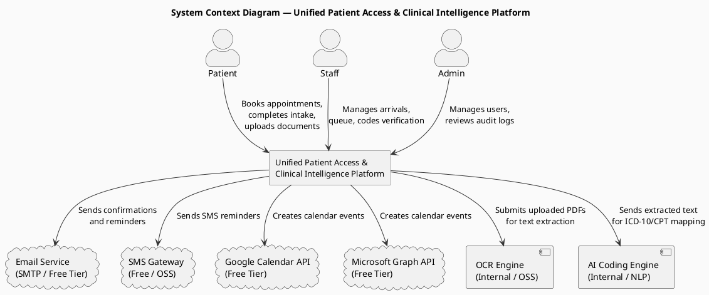

### Use Case Specifications

---

#### UC-001: Patient Self-Registration

- **Actor(s)**: Patient
- **Parent Requirements**: FR-001, FR-003
- **Goal**: New patient creates a platform account with a verified email address.
- **Preconditions**: User has a valid email address and is not already registered.
- **Success Scenario**:
  1. Patient navigates to the registration page.
  2. Patient enters name, date of birth, contact phone, and email address.
  3. System validates field completeness and format.
  4. System sends a verification email with a time-limited token link.
  5. Patient clicks the verification link.
  6. System activates the patient account and assigns the Patient role.
  7. System redirects patient to the login page.
- **Extensions/Alternatives**:
  - 3a. Validation fails (missing/invalid field) → System highlights invalid fields; patient corrects and resubmits.
  - 4a. Email delivery fails → System displays a retry prompt; patient can request resend after 60 seconds.
  - 5a. Verification token expired (>24 hours) → System prompts patient to request a new verification email.
  - 5b. Email already registered → System notifies patient and offers a login or password-reset link; no duplicate account created.
- **Postconditions**: Patient account is active with Patient role; patient can log in and access booking features.

##### Use Case Diagram

<!-- RENDER type="plantuml" src="./uml-models/uc-001-patient-registration.png" -->


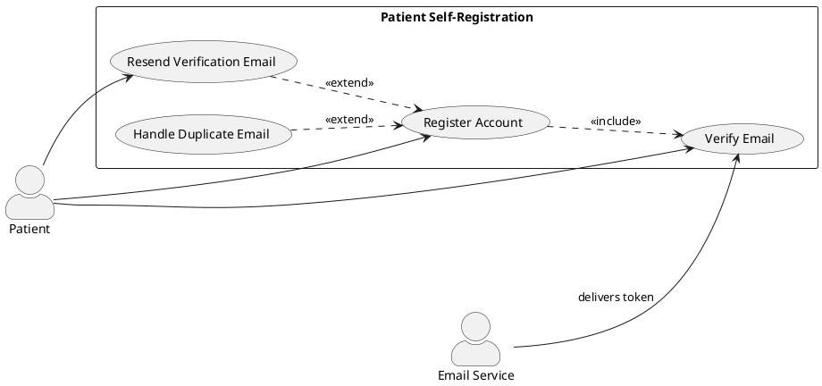

---

#### UC-002: Patient/Staff/Admin Login & Session Management

- **Actor(s)**: Patient, Staff, Admin
- **Parent Requirements**: FR-003, FR-004, FR-006
- **Goal**: Authenticated user gains role-scoped access; inactive session is securely terminated.
- **Preconditions**: User account exists and is active.
- **Success Scenario**:
  1. User navigates to the login page and enters credentials.
  2. System validates credentials against stored hashed values.
  3. System issues a session token scoped to the user's assigned role.
  4. System redirects user to the role-appropriate dashboard.
  5. System monitors session activity; after 15 minutes of inactivity the session token is invalidated.
  6. System redirects user to the login page with a timeout notification.
- **Extensions/Alternatives**:
  - 2a. Invalid credentials → System shows a generic failure message (no role or account existence disclosure); after 5 consecutive failures the account is locked for 15 minutes.
  - 2b. Account locked → System displays lock duration and offers contact information.
  - 2c. Account deactivated by Admin → System displays deactivation notice; no session issued.
  - 3a. Attempted cross-role URL access → System returns HTTP 403; user remains on their permitted dashboard.
- **Postconditions**: User holds an active role-scoped session; or session terminated and user returned to login.

##### Use Case Diagram

<!-- RENDER type="plantuml" src="./uml-models/uc-002-login-session.png" -->


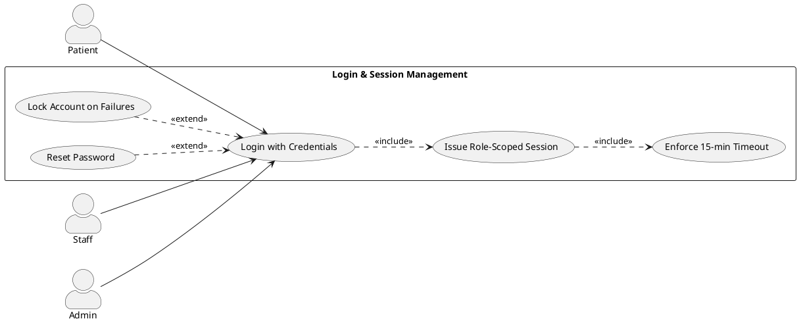

---

#### UC-003: Admin User Account Management

- **Actor(s)**: Admin
- **Parent Requirements**: FR-002, FR-003
- **Goal**: Admin creates, edits, deactivates, or reactivates Staff and Admin accounts.
- **Preconditions**: Admin is authenticated with the Admin role.
- **Success Scenario**:
  1. Admin navigates to the User Management dashboard.
  2. Admin selects "Create User", enters name, email, and assigns a role (Staff or Admin).
  3. System creates the account in an inactive state and sends a credential-setup email to the new user.
  4. New user completes credential setup; account becomes active.
  5. Admin can search existing accounts, edit name/role, or deactivate/reactivate accounts at any time.
  6. All actions are recorded in the immutable audit log.
- **Extensions/Alternatives**:
  - 2a. Email already exists in system → System prevents duplicate and notifies Admin.
  - 3a. Credential-setup email fails → System queues retry; Admin can manually resend from the dashboard.
  - 5a. Admin attempts to deactivate the last active Admin account → System blocks action and displays a guard message.
- **Postconditions**: Account reflects the intended state (created/edited/deactivated/reactivated); audit log updated.

##### Use Case Diagram

<!-- RENDER type="plantuml" src="./uml-models/uc-003-admin-user-mgmt.png" -->


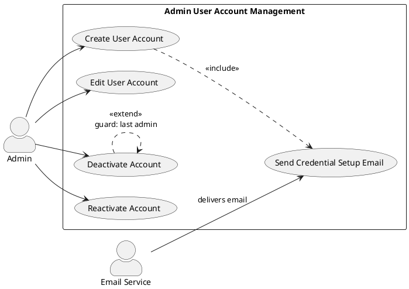

---

#### UC-004: Patient Books Available Appointment

- **Actor(s)**: Patient
- **Parent Requirements**: FR-007, FR-010
- **Goal**: Patient selects and confirms an available appointment slot.
- **Preconditions**: Patient is authenticated; available slots exist on the calendar.
- **Success Scenario**:
  1. Patient opens the Appointments section and views the calendar of available slots.
  2. Patient selects a date and available time slot.
  3. System displays appointment summary (date, time, location) for confirmation.
  4. Patient confirms booking.
  5. System creates the appointment record, calculates and stores the no-show risk score, and marks the slot as unavailable.
  6. System triggers FR-014 (confirmation email with PDF) and FR-023/FR-024 (reminder scheduling).
- **Extensions/Alternatives**:
  - 2a. Slot taken by another patient between selection and confirmation → System notifies patient of unavailability and refreshes the calendar.
  - 4a. Patient has an existing active appointment → System warns of conflict; patient must cancel existing appointment before booking a new one.
  - 5a. Notification service unavailable → Appointment is still confirmed; notifications are queued for retry.
- **Postconditions**: Appointment confirmed; slot marked unavailable; no-show risk score stored; reminders scheduled.

##### Use Case Diagram

<!-- RENDER type="plantuml" src="./uml-models/uc-004-book-appointment.png" -->


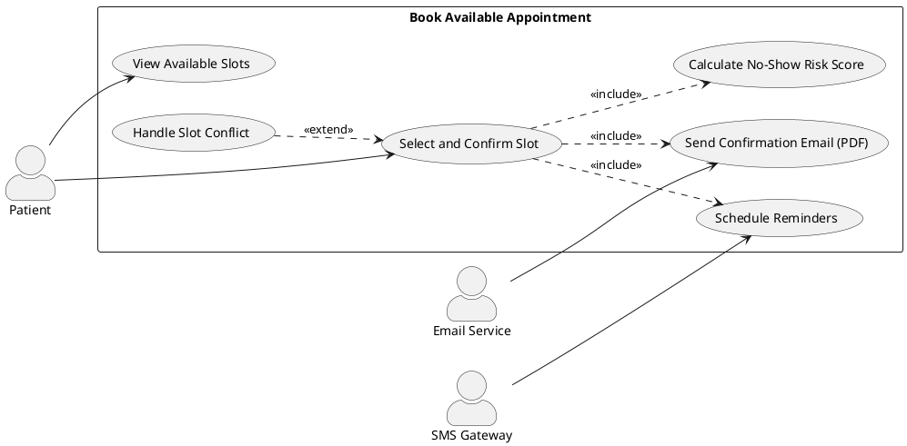

---

#### UC-005: Patient Joins Waitlist for Preferred Slot

- **Actor(s)**: Patient
- **Parent Requirements**: FR-008
- **Goal**: Patient registers interest in an unavailable slot while booking an available alternative.
- **Preconditions**: Patient has confirmed or is confirming an available appointment; preferred slot is currently unavailable.
- **Success Scenario**:
  1. During or after booking, patient indicates a preferred slot that is currently unavailable.
  2. System records the preferred slot as a waitlist entry linked to the patient's confirmed appointment.
  3. System confirms to patient: "You are on the waitlist for [date/time]. We will notify you if it becomes available."
- **Extensions/Alternatives**:
  - 1a. Patient already has an active waitlist entry → System replaces the old entry with the new preferred slot.
  - 2a. Preferred slot is in the past or outside booking window → System rejects the entry and prompts patient to choose a valid future slot.
- **Postconditions**: Waitlist entry created linking patient to their preferred slot; system will monitor for slot availability.

##### Use Case Diagram

<!-- RENDER type="plantuml" src="./uml-models/uc-005-waitlist.png" -->


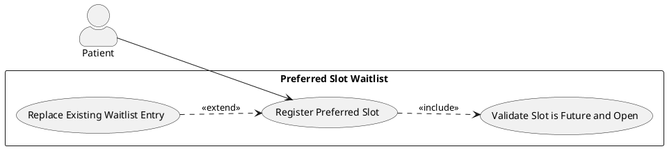

---

#### UC-006: System Executes Preferred Slot Swap

- **Actor(s)**: System (automated), Patient
- **Parent Requirements**: FR-009
- **Goal**: System automatically offers and applies appointment swap when a preferred slot opens.
- **Preconditions**: Patient has an active waitlist entry; the preferred slot becomes available (cancelled by another patient or released by Staff).
- **Success Scenario**:
  1. A slot is released back into the available pool.
  2. System queries active waitlist entries for patients who requested that slot.
  3. System notifies the first eligible patient (by waitlist registration time) via email and SMS that their preferred slot is now available, with a 2-hour response window (configurable).
  4. Patient accepts the swap within the response window.
  5. System updates the appointment to the new slot, marks the old slot as available, and removes the waitlist entry.
  6. System sends a new confirmation email with updated PDF appointment details.
- **Extensions/Alternatives**:
  - 4a. Patient declines the swap → System removes the waitlist entry for that patient; slot remains available; next waitlisted patient is notified.
  - 4b. Response window expires without patient action → System treats as implicit decline; processes as 4a.
  - 5a. Preferred slot taken by another booking before patient accepts → System notifies patient of unavailability; waitlist entry cleared.
- **Postconditions**: Appointment swapped and confirmed at new slot; or waitlist entry cleared with slot remaining available.

##### Use Case Diagram

<!-- RENDER type="plantuml" src="./uml-models/uc-006-slot-swap.png" -->


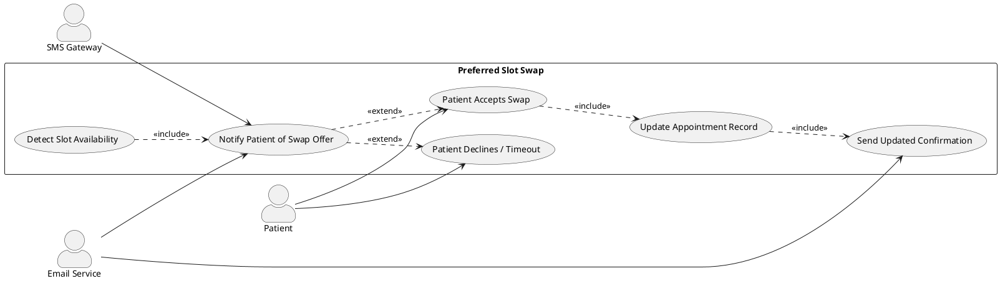

---

#### UC-007: Patient Cancels or Reschedules Appointment

- **Actor(s)**: Patient
- **Parent Requirements**: FR-011
- **Goal**: Patient cancels or moves an existing confirmed appointment before the cutoff window.
- **Preconditions**: Patient is authenticated; appointment exists in Scheduled state; appointment is beyond the cancellation cutoff time.
- **Success Scenario**:
  1. Patient navigates to "My Appointments" and selects an upcoming appointment.
  2. Patient chooses "Cancel" or "Reschedule".
  3. **Cancel path:** System cancels the appointment, releases the slot, removes active reminders, and sends a cancellation confirmation email.
  4. **Reschedule path:** System presents available slots; patient selects a new slot; system creates a new appointment and releases the original slot; sends a new confirmation email with updated PDF.
- **Extensions/Alternatives**:
  - 2a. Appointment is within the cancellation cutoff window → System blocks the action and displays the cutoff rule; patient is directed to contact Staff.
  - 3a. Released slot triggers a waitlist notification (UC-006) for another patient.
- **Postconditions**: Appointment cancelled or rescheduled; original slot released; reminders updated or removed.

##### Use Case Diagram

<!-- RENDER type="plantuml" src="./uml-models/uc-007-cancel-reschedule.png" -->


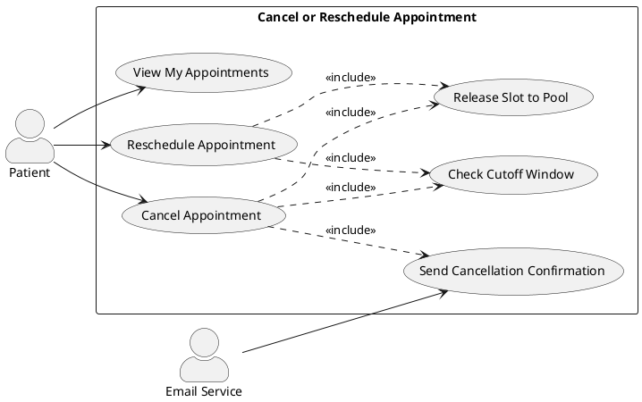

---

#### UC-008: Patient Completes AI Conversational Intake

- **Actor(s)**: Patient
- **Parent Requirements**: FR-015
- **Goal**: Patient completes pre-appointment intake through an AI-guided conversational dialogue.
- **Preconditions**: Patient has a confirmed appointment; intake not yet submitted; patient selects the AI intake path.
- **Success Scenario**:
  1. Patient opens the intake section and selects "AI-Assisted Intake".
  2. AI dialogue prompts patient for demographics (if not already on profile), chief complaint, medical history, current medications, and allergies in natural conversation turns.
  3. Patient responds to each prompt; AI confirms understanding and moves to the next topic.
  4. After all topics are covered, system displays a structured summary for patient review.
  5. Patient confirms the summary; system stores responses as structured intake record.
- **Extensions/Alternatives**:
  - 2a. Patient's response is ambiguous → AI requests clarification with a follow-up prompt.
  - 3a. Patient wants to switch to manual form mid-flow → System preserves entered data and transitions to manual form (UC-009).
  - 5a. Patient edits a field in the summary → System updates the field and re-presents the corrected summary for final confirmation.
- **Postconditions**: Structured intake record stored; intake marked complete; insurance pre-check (UC-010) is available for trigger.

##### Use Case Diagram

<!-- RENDER type="plantuml" src="./uml-models/uc-008-ai-intake.png" -->


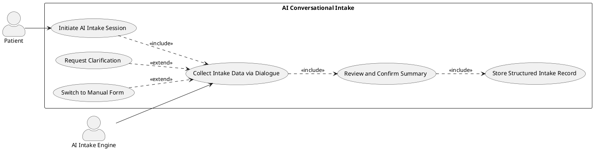

---

#### UC-009: Patient Completes Manual Intake Form

- **Actor(s)**: Patient
- **Parent Requirements**: FR-016, FR-017
- **Goal**: Patient completes or edits intake using a structured static form.
- **Preconditions**: Patient has a confirmed appointment; patient selects manual intake path or is editing a prior submission.
- **Success Scenario**:
  1. Patient opens the intake form (new or edit mode).
  2. Patient fills in demographics, chief complaint, medical history, medications, and allergies.
  3. Patient submits the form.
  4. System validates completeness and stores the intake record.
  5. For edit mode: system records the prior values and new values in the audit log.
- **Extensions/Alternatives**:
  - 3a. Required fields missing → System highlights missing fields; submission blocked until corrected.
  - 4a. Patient edits again after submission → System permits edit; audit log captures delta.
- **Postconditions**: Intake record created or updated; audit log updated for edits; insurance pre-check available.

##### Use Case Diagram

<!-- RENDER type="plantuml" src="./uml-models/uc-009-manual-intake.png" -->


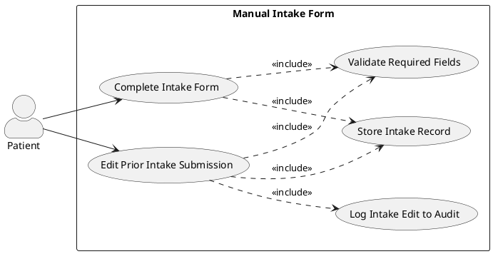

---

#### UC-010: System Performs Insurance Pre-Check

- **Actor(s)**: Patient (triggers via intake submission), System
- **Parent Requirements**: FR-018
- **Goal**: System validates entered insurance details against dummy records and surfaces a result.
- **Preconditions**: Patient has submitted intake data with insurance provider name and insurance ID.
- **Success Scenario**:
  1. Patient enters insurance provider name and insurance ID in the intake form.
  2. System queries the pre-loaded dummy records store for a matching provider name + ID combination.
  3. System displays a "Validated" indicator alongside the insurance fields.
- **Extensions/Alternatives**:
  - 2a. No matching record found → System displays a non-blocking "Insurance details not verified" warning; patient can proceed.
  - 2b. Insurance fields left blank → System skips validation; no indicator shown; intake can still be submitted.
- **Postconditions**: Insurance validation result stored with intake record; booking flow unblocked regardless of result.

##### Use Case Diagram

<!-- RENDER type="plantuml" src="./uml-models/uc-010-insurance-precheck.png" -->


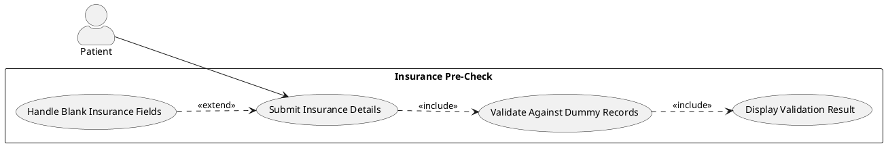

---

#### UC-011: System Sends Appointment Reminders & Confirmation

- **Actor(s)**: System (automated), Email Service, SMS Gateway
- **Parent Requirements**: FR-014, FR-023, FR-024
- **Goal**: System delivers timely confirmation and reminder communications to patients.
- **Preconditions**: Appointment is confirmed; patient has email address and/or phone on file.
- **Success Scenario**:
  1. Immediately on booking confirmation: system generates PDF with appointment details and sends confirmation email (FR-014).
  2. At 48 hours before appointment: system sends SMS and email reminders with appointment details and cancel/reschedule link.
  3. At 2 hours before appointment: system sends second SMS and email reminder.
- **Extensions/Alternatives**:
  - 1a. PDF generation fails → System queues retry up to 3 times; if all fail, email is sent without PDF attachment and failure is logged.
  - 2a. SMS gateway unavailable → SMS queued for retry; email proceeds independently.
  - 2b. Email delivery bounces → Bounce logged; Staff dashboard flags the patient communication failure.
  - 3a. Appointment cancelled before reminder fires → System cancels the pending reminder jobs.
- **Postconditions**: Confirmation and reminders delivered or failures logged; pending reminders cancelled if appointment is cancelled.

##### Use Case Diagram

<!-- RENDER type="plantuml" src="./uml-models/uc-011-reminders.png" -->


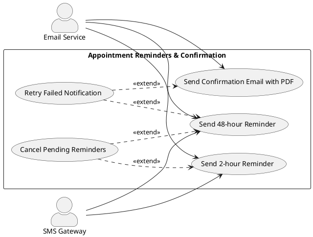

---

#### UC-012: Patient Syncs Appointment to Calendar

- **Actor(s)**: Patient, Google Calendar API, Microsoft Graph API
- **Parent Requirements**: FR-012, FR-013
- **Goal**: Patient adds confirmed appointment as a calendar event in Google or Outlook Calendar.
- **Preconditions**: Patient is authenticated; appointment is in Confirmed state.
- **Success Scenario**:
  1. Patient views appointment confirmation page or appointment detail.
  2. Patient clicks "Add to Google Calendar" or "Add to Outlook Calendar".
  3. System redirects patient through the applicable OAuth consent flow.
  4. Patient grants calendar write permission.
  5. System calls the respective API to create a calendar event with appointment date, time, location, and provider name.
  6. System confirms to patient: "Appointment added to your calendar."
- **Extensions/Alternatives**:
  - 3a. Patient denies OAuth consent → System returns to confirmation page with no event created; patient can retry.
  - 5a. API call fails (rate limit, timeout) → System displays an error and offers a retry option; appointment remains confirmed.
  - 5b. Patient reschedules appointment → Previous calendar event is updated via API; if update fails, system instructs patient to manually update.
- **Postconditions**: Calendar event created in patient's chosen calendar; or failure surfaced with retry option.

##### Use Case Diagram

<!-- RENDER type="plantuml" src="./uml-models/uc-012-calendar-sync.png" -->


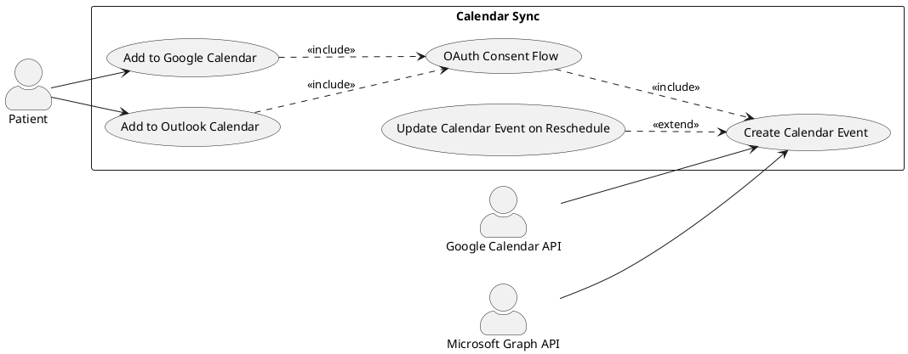

---

#### UC-013: Staff Registers Walk-In Patient

- **Actor(s)**: Staff
- **Parent Requirements**: FR-019
- **Goal**: Staff adds a walk-in patient directly to the same-day queue without prior booking.
- **Preconditions**: Staff is authenticated; current date has available same-day queue capacity.
- **Success Scenario**:
  1. Staff navigates to "Walk-In Registration".
  2. Staff searches for an existing patient by name/DOB or creates a new minimal patient profile.
  3. Staff confirms the walk-in entry.
  4. System adds the patient to the same-day queue with a timestamp and walk-in flag.
  5. Audit log records the Staff user who registered the walk-in.
- **Extensions/Alternatives**:
  - 2a. No matching patient found → Staff creates a new minimal patient profile (name, DOB, contact); patient can complete full registration later.
  - 4a. Same-day queue is at maximum capacity (configurable limit) → System warns Staff; Staff can override with confirmation.
- **Postconditions**: Walk-in patient appears in same-day queue with walk-in flag; audit log updated.

##### Use Case Diagram

<!-- RENDER type="plantuml" src="./uml-models/uc-013-walkin.png" -->


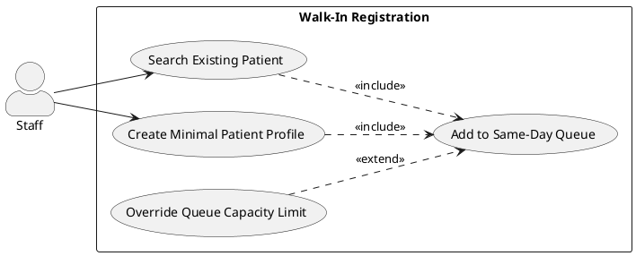

---

#### UC-014: Staff Manages Same-Day Queue

- **Actor(s)**: Staff
- **Parent Requirements**: FR-020
- **Goal**: Staff views and controls the live same-day patient queue.
- **Preconditions**: Staff is authenticated; same-day queue contains at least one entry.
- **Success Scenario**:
  1. Staff opens the Same-Day Queue dashboard.
  2. System displays all queued patients with position, entry time, walk-in flag, and estimated wait.
  3. Staff reorders queue entries using drag-and-drop or position input.
  4. System persists the new order and recalculates estimated wait times.
  5. Staff removes a patient from the queue (e.g., patient left).
  6. System removes the entry and compresses positions.
- **Extensions/Alternatives**:
  - 3a. Two Staff users reorder simultaneously → System applies optimistic locking; second update is rejected with a refresh prompt.
  - 5a. Patient marked as checked-in (UC-015) — removal from queue is automatic.
- **Postconditions**: Queue reflects current ordered state; estimated wait times updated.

##### Use Case Diagram

<!-- RENDER type="plantuml" src="./uml-models/uc-014-queue-mgmt.png" -->


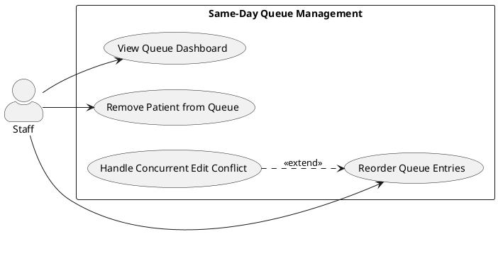

---

#### UC-015: Staff Checks In Patient Arrival

- **Actor(s)**: Staff
- **Parent Requirements**: FR-021, FR-022
- **Goal**: Staff marks a patient as arrived for their scheduled or walk-in appointment.
- **Preconditions**: Staff is authenticated; patient is in the daily schedule or same-day queue.
- **Success Scenario**:
  1. Staff locates the patient on the daily schedule or same-day queue dashboard.
  2. Staff clicks "Check In" for the patient.
  3. System updates appointment status to "Arrived" and timestamps the check-in.
  4. Audit log records the Staff user and timestamp.
  5. Patient is removed from same-day queue (if applicable).
- **Extensions/Alternatives**:
  - 2a. Patient not found in schedule → Staff searches by name/appointment ID; if still not found, Staff registers as walk-in (UC-013).
  - 3a. Appointment already marked Arrived → System shows warning; Staff confirms intentional duplicate (e.g., correcting error).
- **Postconditions**: Appointment status = "Arrived"; audit log updated; patient removed from queue if queued.

##### Use Case Diagram

<!-- RENDER type="plantuml" src="./uml-models/uc-015-checkin.png" -->


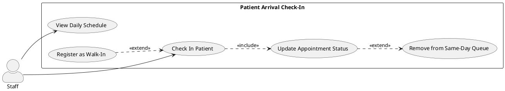

---

#### UC-016: Staff Reviews No-Show Risk Alerts

- **Actor(s)**: Staff
- **Parent Requirements**: FR-010, FR-025
- **Goal**: Staff identifies high-risk appointments and takes proactive outreach action.
- **Preconditions**: Staff is authenticated; daily schedule contains appointments with computed no-show risk scores.
- **Success Scenario**:
  1. Staff views the daily schedule; high-risk appointments are visually flagged.
  2. Staff filters by high-risk flag.
  3. Staff contacts the patient (phone/email outside the platform) and records outreach in the appointment notes.
  4. Staff optionally overrides the risk flag after successful contact.
- **Extensions/Alternatives**:
  - 2a. No high-risk appointments for the day → Dashboard shows "No high-risk appointments today."
  - 4a. Patient no-shows despite outreach → Staff marks appointment as "No-Show" from the daily schedule; no-show history used in future risk calculations.
- **Postconditions**: High-risk appointments reviewed; outreach recorded; no-show marked if applicable.

##### Use Case Diagram

<!-- RENDER type="plantuml" src="./uml-models/uc-016-noshow-risk.png" -->


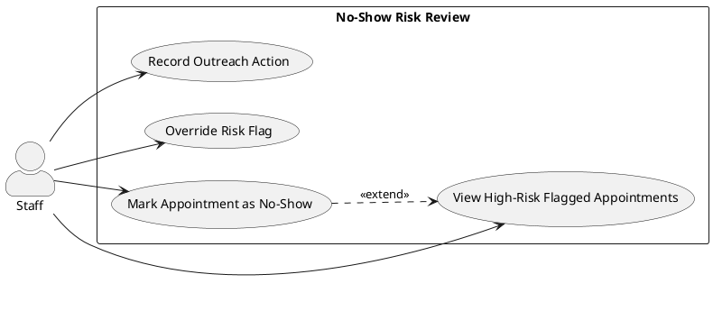

---

#### UC-017: Patient Uploads Clinical Documents

- **Actor(s)**: Patient
- **Parent Requirements**: FR-026, FR-027
- **Goal**: Patient securely uploads historical clinical PDF documents to their profile.
- **Preconditions**: Patient is authenticated; document is in a supported format (PDF minimum).
- **Success Scenario**:
  1. Patient navigates to "My Documents" and selects "Upload Document".
  2. Patient selects a file from local device.
  3. System validates file type, file size (≤ configurable limit), and performs virus scan.
  4. System encrypts the file at rest (AES-256) and stores it linked to the patient's record.
  5. System confirms upload success and displays the document in the patient's document list.
- **Extensions/Alternatives**:
  - 3a. File exceeds size limit → System rejects with a clear message and the allowed maximum size.
  - 3b. File fails virus scan → System rejects the file and logs the incident; patient is notified.
  - 3c. Unsupported file format → System rejects with supported formats listed.
  - 4a. Storage failure → System rolls back the incomplete upload; patient is prompted to retry.
- **Postconditions**: Document encrypted and stored; linked to patient record; available for clinical data extraction.

##### Use Case Diagram

<!-- RENDER type="plantuml" src="./uml-models/uc-017-document-upload.png" -->


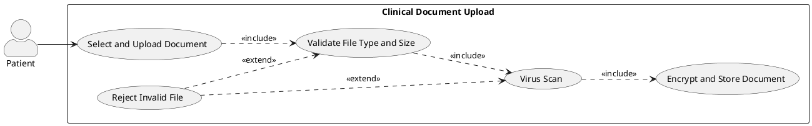

---

#### UC-018: System Ingests and Extracts Clinical Data

- **Actor(s)**: System (automated), OCR Engine
- **Parent Requirements**: FR-028, FR-029
- **Goal**: System processes uploaded documents and extracts structured clinical data fields.
- **Preconditions**: At least one document is linked to a patient record and pending extraction.
- **Success Scenario**:
  1. System (background job) detects a new document pending extraction.
  2. System submits the document to the OCR Engine for text extraction.
  3. OCR Engine returns machine-readable text.
  4. System applies NLP/extraction logic to identify and extract: vital signs, chief complaint, medical history, medications, allergies, and diagnosis narratives.
  5. Extracted fields are stored as structured records linked to the patient.
- **Extensions/Alternatives**:
  - 2a. OCR Engine unavailable → Job is retried with exponential backoff (max 3 retries); Staff dashboard flags the document as "Extraction Pending".
  - 3a. OCR confidence below threshold → Document is flagged for manual review; extracted fields marked as low-confidence.
  - 4a. No recognized clinical fields found → Document is flagged as "No extractable data"; stored but not included in aggregation.
- **Postconditions**: Structured fields stored; document status updated (Extracted, Pending Review, or No Data).

##### Use Case Diagram

<!-- RENDER type="plantuml" src="./uml-models/uc-018-data-extraction.png" -->


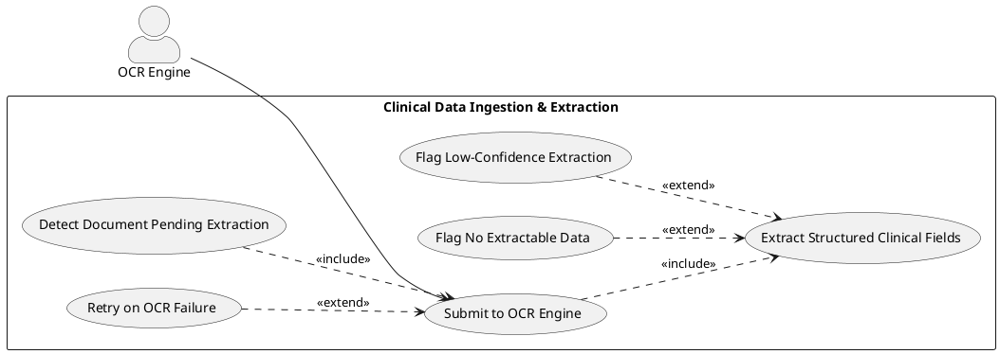

---

#### UC-019: System Detects and Flags Data Conflicts

- **Actor(s)**: System (automated), Staff
- **Parent Requirements**: FR-030, FR-031
- **Goal**: System consolidates extracted data, de-duplicates, and flags critical conflicts for Staff review.
- **Preconditions**: At least two documents with extracted fields exist for a patient.
- **Success Scenario**:
  1. System compares extracted field values across all documents for a patient.
  2. System de-duplicates: for non-conflicting duplicates, retains the most recent value.
  3. System detects critical conflicts (e.g., same medication with different dosages; contradictory allergy entries).
  4. Conflicting entries are flagged with source document references.
  5. System marks the 360° view as "Requires Review" until Staff resolves all flagged conflicts.
- **Extensions/Alternatives**:
  - 3a. No conflicts found → All fields de-duplicated; 360° view marked "Ready for Review".
  - 5a. Staff resolves a conflict by selecting the authoritative value → Conflict flag cleared; selection recorded in audit log.
  - 5b. Staff dismisses a conflict without resolution → Conflict flag remains; dismissal action logged.
- **Postconditions**: De-duplicated patient record with conflict flags applied; 360° view status updated.

##### Use Case Diagram

<!-- RENDER type="plantuml" src="./uml-models/uc-019-conflict-detection.png" -->


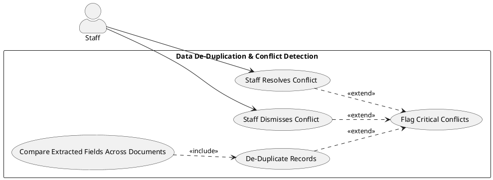

---

#### UC-020: Staff Reviews 360° Patient View

- **Actor(s)**: Staff
- **Parent Requirements**: FR-032
- **Goal**: Staff accesses a consolidated, verified patient record before or during a clinical encounter.
- **Preconditions**: Staff is authenticated; patient has at least one extracted document; 360° view is "Ready for Review" or "Requires Review".
- **Success Scenario**:
  1. Staff opens a patient appointment record and selects "360° Patient View".
  2. System displays the consolidated view: vitals, medical history, medications, allergies, diagnosis narratives, and any conflict flags.
  3. Staff reviews each section; conflict flags link to source documents for reference.
  4. Staff resolves any pending conflicts (UC-019).
  5. Staff marks the view as "Verified".
- **Extensions/Alternatives**:
  - 2a. No extracted documents exist → System shows "No clinical documents on file" prompt with a link to the document upload path (UC-017).
  - 4a. Conflicts remain unresolved → System prevents Staff from marking as "Verified" until all critical flags are resolved or explicitly dismissed.
- **Postconditions**: 360° view marked Verified; conflict resolutions stored; Staff can proceed to code generation (UC-021).

##### Use Case Diagram

<!-- RENDER type="plantuml" src="./uml-models/uc-020-360-view.png" -->


```plantuml
@startuml uc-020-360-view
left to right direction
skinparam actorStyle awesome

actor Staff as S

rectangle "360° Patient View" {
  usecase "Open 360° Patient View" as UC1
  usecase "Review Consolidated Fields" as UC2
  usecase "Resolve Conflict Flags" as UC3
  usecase "Mark View as Verified" as UC4
  usecase "Navigate to Document Upload" as UC5
}

S --> UC1
UC1 ..> UC2 : <<include>>
UC2 ..> UC3 : <<extend>>
UC2 ..> UC4 : <<include>>
UC5 ..> UC1 : <<extend>>
@enduml
```

---

#### UC-021: System Generates ICD-10 and CPT Codes

- **Actor(s)**: System (AI Coding Engine), Staff
- **Parent Requirements**: FR-033, FR-034
- **Goal**: System maps verified patient data to ICD-10 and CPT codes for Staff review.
- **Preconditions**: 360° patient view is in "Verified" state; AI Coding Engine is available.
- **Success Scenario**:
  1. Staff triggers code generation from the 360° patient view (or system triggers automatically on Verified status).
  2. AI Coding Engine receives the extracted clinical narratives and structured fields.
  3. Engine returns top-matched ICD-10 codes (with confidence scores) for each diagnosis narrative.
  4. Engine returns top-matched CPT codes (with confidence scores) for procedural entries.
  5. Results are stored as pending-verification code suggestions linked to the patient record.
- **Extensions/Alternatives**:
  - 2a. AI Coding Engine unavailable → System queues the request; Staff dashboard shows "Code generation pending"; retries automatically when engine recovers.
  - 3a. Confidence score below acceptable threshold (configurable) → Suggestion flagged as "Low Confidence"; Staff is strongly prompted to review manually.
  - 4a. No CPT-mappable procedures found in data → CPT section shows "No procedures identified"; no code suggested.
- **Postconditions**: ICD-10 and CPT code suggestions stored with confidence scores; presented in the Staff verification interface (UC-022).

##### Use Case Diagram

<!-- RENDER type="plantuml" src="./uml-models/uc-021-code-generation.png" -->


```plantuml
@startuml uc-021-code-generation
left to right direction
skinparam actorStyle awesome

actor Staff as S
actor "AI Coding Engine" as AI

rectangle "ICD-10 & CPT Code Generation" {
  usecase "Trigger Code Generation" as UC1
  usecase "Map to ICD-10 Codes" as UC2
  usecase "Map to CPT Codes" as UC3
  usecase "Flag Low-Confidence Suggestions" as UC4
  usecase "Queue on Engine Unavailable" as UC5
}

S --> UC1
UC1 ..> UC2 : <<include>>
UC1 ..> UC3 : <<include>>
UC4 ..> UC2 : <<extend>>
UC4 ..> UC3 : <<extend>>
UC5 ..> UC1 : <<extend>>
AI --> UC2
AI --> UC3
@enduml
```

---

#### UC-022: Staff Verifies Medical Codes

- **Actor(s)**: Staff
- **Parent Requirements**: FR-035
- **Goal**: Staff reviews AI-generated code suggestions and accepts, modifies, or rejects each before committing to the patient record.
- **Preconditions**: Code suggestions exist in "Pending Verification" state for the patient.
- **Success Scenario**:
  1. Staff opens the Medical Codes verification panel from the patient record.
  2. System displays all ICD-10 and CPT suggestions with codes, descriptions, confidence scores, and source evidence.
  3. Staff reviews each suggestion:
     - **Accept**: code is committed to the record.
     - **Modify**: Staff edits the code or description; modified code is committed.
     - **Reject**: suggestion is discarded; Staff may enter a manual code replacement.
  4. After all suggestions are actioned, Staff marks the coding task as complete.
  5. All actions logged in the audit trail.
- **Extensions/Alternatives**:
  - 3a. Staff accepts all → Single "Accept All" action with a confirmation prompt before commit.
  - 3b. No suggestions available → Staff can enter codes manually from scratch.
  - 4a. Staff attempts to mark complete with unreviewed suggestions remaining → System blocks and highlights unreviewed items.
- **Postconditions**: All committed codes stored in patient record with verification timestamp and Staff identity; audit log updated.

##### Use Case Diagram

<!-- RENDER type="plantuml" src="./uml-models/uc-022-code-verification.png" -->


```plantuml
@startuml uc-022-code-verification
left to right direction
skinparam actorStyle awesome

actor Staff as S

rectangle "Medical Code Verification" {
  usecase "Review Code Suggestions" as UC1
  usecase "Accept Code" as UC2
  usecase "Modify Code" as UC3
  usecase "Reject Code" as UC4
  usecase "Enter Manual Code" as UC5
  usecase "Mark Coding Complete" as UC6
}

S --> UC1
UC1 ..> UC2 : <<extend>>
UC1 ..> UC3 : <<extend>>
UC1 ..> UC4 : <<extend>>
UC4 ..> UC5 : <<extend>>
UC1 ..> UC6 : <<include>>
@enduml
```

---

#### UC-023: Admin Reviews Audit Log

- **Actor(s)**: Admin
- **Parent Requirements**: FR-005
- **Goal**: Admin views the immutable audit log for compliance review and incident investigation.
- **Preconditions**: Admin is authenticated; audit log contains entries.
- **Success Scenario**:
  1. Admin navigates to the Audit Log section.
  2. Admin filters by date range, actor, action type, or affected record.
  3. System returns paginated log entries matching filters.
  4. Admin exports filtered results as CSV for external review.
- **Extensions/Alternatives**:
  - 2a. No entries match filters → System shows "No records found" with current filter state.
  - 4a. Export of large result set (>10,000 rows) → System generates the file asynchronously and notifies Admin when ready for download.
  - 5a. Any attempt to modify or delete an audit entry via API → System returns HTTP 405 Method Not Allowed; attempt is itself logged.
- **Postconditions**: Audit entries returned and optionally exported; log integrity unchanged.

##### Use Case Diagram

<!-- RENDER type="plantuml" src="./uml-models/uc-023-audit-log.png" -->


```plantuml
@startuml uc-023-audit-log
left to right direction
skinparam actorStyle awesome

actor Admin as A

rectangle "Audit Log Review" {
  usecase "View Audit Log" as UC1
  usecase "Filter Audit Entries" as UC2
  usecase "Export Audit Results" as UC3
  usecase "Block Audit Modification Attempt" as UC4
}

A --> UC1
A --> UC2
A --> UC3
UC4 ..> UC1 : <<extend>>
@enduml
```

---

#### UC-024: System Handles Session Timeout

- **Actor(s)**: System (automated), Patient, Staff, Admin
- **Parent Requirements**: FR-004
- **Goal**: System automatically invalidates sessions after 15 minutes of inactivity.
- **Preconditions**: A user session exists and the user has been inactive for 15 minutes.
- **Success Scenario**:
  1. System detects no user activity for 15 consecutive minutes on an active session.
  2. System invalidates the session token server-side.
  3. System redirects the user's browser to the login page with a timeout message.
  4. Any in-flight API request using the invalidated token receives HTTP 401.
- **Extensions/Alternatives**:
  - 1a. User performs an action before the 15-minute mark → Inactivity timer resets.
  - 3a. User had unsaved form data → System displays a warning 2 minutes before timeout, offering the user a chance to extend the session; if extended, timer resets.
- **Postconditions**: Session invalidated; user redirected to login; all subsequent requests with stale token rejected with 401.

##### Use Case Diagram

<!-- RENDER type="plantuml" src="./uml-models/uc-024-session-timeout.png" -->


```plantuml
@startuml uc-024-session-timeout
left to right direction
skinparam actorStyle awesome

actor Patient as P
actor Staff as S
actor Admin as A

rectangle "Session Timeout" {
  usecase "Monitor Session Inactivity" as UC1
  usecase "Warn User Before Timeout" as UC2
  usecase "Extend Session on Activity" as UC3
  usecase "Invalidate Session Token" as UC4
  usecase "Redirect to Login" as UC5
  usecase "Reject Stale Token (401)" as UC6
}

UC1 ..> UC2 : <<extend>>
UC2 ..> UC3 : <<extend>>
UC1 ..> UC4 : <<include>>
UC4 ..> UC5 : <<include>>
UC4 ..> UC6 : <<include>>
P --> UC3
S --> UC3
A --> UC3
@enduml
```

---

## Risks & Mitigations

- **AI Extraction Accuracy Below Target:** The AI-Human Agreement Rate target is ≥98%; if the OCR or NLP extraction produces low-confidence results at scale, clinical data quality degrades. *Mitigation:* All AI output requires explicit Staff verification before commit; confidence thresholds surface low-quality suggestions for manual override; no code is committed without human sign-off.
- **Preferred Slot Swap Race Condition:** Two patients on the waitlist for the same slot could result in double-booking if swap logic is not atomic. *Mitigation:* Slot reservation uses optimistic locking with a database transaction; the second concurrent swap attempt fails gracefully and notifies the patient.
- **No-Show Risk Model Accuracy:** Rule-based scoring may not reflect clinical context nuances, leading to over- or under-flagging. *Mitigation:* Model rules are configurable by Admin; flags are advisory only and do not block scheduling; Staff can override flags.
- **Third-Party API Dependency (Calendar, SMS, Email):** Free-tier API rate limits or outages can block notifications and calendar sync. *Mitigation:* All notification jobs are queued with retry logic; calendar sync failure is non-blocking; appointment confirmation proceeds regardless of downstream service availability.
- **HIPAA Compliance Gap at Upload:** Unencrypted clinical documents stored even briefly before encryption apply could create a compliance gap. *Mitigation:* Documents are encrypted before write confirmation is returned to the client; no plaintext intermediate storage; virus scan executes on the encrypted stream with an isolated scan agent.
- **Session Hijacking:** Long-lived session tokens could be stolen and reused. *Mitigation:* 15-minute inactivity timeout enforced server-side; tokens are short-lived JWTs; HTTPS enforced for all endpoints; CSRF protection applied to all state-changing requests.
- **Data Volume — Multi-Document Patients:** Patients with many uploaded documents could create extraction and aggregation performance bottlenecks. *Mitigation:* Background job queue (open-source queue e.g. Hangfire) processes extraction asynchronously; 360° view is generated on-demand with cached results; large exports run asynchronously.

---

## Constraints & Assumptions

- **C-001 [SOURCE:INPUT]:** All infrastructure MUST be deployable on free/open-source platforms (Netlify, Vercel, GitHub Codespaces, Windows Services/IIS). No paid cloud services (AWS, Azure) are in scope.
- **C-002 [SOURCE:INPUT]:** All third-party integrations (calendar, SMS, email) MUST use free-tier or open-source APIs only. No paid SaaS integrations.
- **C-003 [SOURCE:INPUT]:** All data handling MUST comply with HIPAA §164.312 technical safeguards, including encryption at rest, access controls, and audit controls.
- **C-004 [SOURCE:INPUT]:** Patients CANNOT self-check-in by any means (app, QR code, kiosk). Check-in is exclusively a Staff operation.
- **C-005 [SOURCE:INPUT]:** Provider (clinician) logins and provider-facing workflows are explicitly out of scope for Phase 1.
- **C-006 [SOURCE:INPUT]:** Payment processing, family member profiles, direct EHR integration, and claims submission are out of scope for Phase 1.
- **C-007 [SOURCE:INFERRED]:** The platform will be a single-tenant deployment per healthcare organization in Phase 1. Multi-tenancy is not in scope.
  Basis: BRD describes a "standalone" platform without multi-organization data segregation requirements; single-tenant is the safe default.
- **C-008 [SOURCE:INFERRED]:** The dummy insurance records store will be populated manually by Admin before go-live; no automated payer feed or real insurance API is used.
  Basis: BRD §6 specifies "soft validation against dummy records" with no payer connectivity.
- **A-001 [SOURCE:INFERRED]:** A free/open-source OCR library (e.g., Tesseract) is sufficient for PDF text extraction quality required by the platform; commercial OCR is not needed.
  Basis: BRD mandates open-source tooling; Tesseract is the leading free OCR engine for PDF workflows.
- **A-002 [SOURCE:INFERRED]:** The AI Coding Engine will use an open-source NLP model or locally-hosted LLM (e.g., Ollama with a medical NLP model) to avoid paid API costs; model selection is a technical decision outside this spec.
  Basis: BRD §5 "Strictly free and open-source stacks for background processing and workflows."
- **A-003 [SOURCE:INPUT]:** The platform targets SQL Server as the primary data store with PostgreSQL for structured data and Upstash Redis for caching as stated in BRD §7.
- **A-004 [SOURCE:INFERRED]:** Appointment slot configuration (available times, provider availability blocks, capacity limits) is managed by Admin or Staff through a configuration interface not detailed in the BRD; this configuration UI is assumed in scope as a dependency of the booking module.
  Basis: Without slot configuration, the booking calendar has no data to display; implied dependency.
